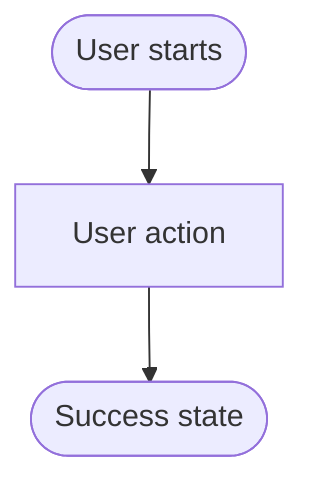

# Scenarios

This directory contains grouped product scenario artifacts. Scenario Markdown is the AI-primary source for behavior and validation intent. Scenario HTML is the human-readable view for reviewing concrete user flows and visual states. This README owns the product definition, classification, format, and approval rules for scenarios; specs, tests, architecture pages, and AI skills must link here instead of redefining them.

## Scenario model

Keep these three units distinct:

- A **journey** is an ordered map of independently valuable user goals, for example create → local debug → remote debug. It helps product reviewers understand the complete experience, but it is not one scenario and does not require one end-to-end UI test.
- A **product scenario** is one independently reviewable user goal. It starts from a declared user-visible state, has one primary goal, and ends in a user-visible success state. It includes applicable surfaces, prerequisites, errors, cancellation, recovery, and user-visible outputs.
- A **validation case** is an independently executable test slice derived from a scenario. Multiple cases may trace to one scenario. Case identity, language, template variant, authentication, feature flags, account profile, and execution gate belong to the applicable test workflow, not to the product scenario's directory hierarchy.

PRDs may use journey maps to connect scenarios. Scenario files remain the behavior contract for each goal. Do not create scenarios by expanding a workload × lifecycle × language × authentication × feature-flag matrix: a template or route proves an implementation option exists, not that the inferred user goal is supported.

## Directory groups

Group scenarios by stable workload or product family:

- [`da/`](da/) - Declarative Agent flows, such as create, test, provision, deploy, and publish DA scenarios.
- `cea/` - Custom Engine Agent flows.
- `teams-app/` - Teams app flows that are not owned by a more specific agent workload.
- `office-addin/` - Office Add-in flows.
- `graph-connector/` - Graph connector flows.
- `toolkit/` - cross-workload login, environment, project-management, and common Toolkit UX flows.

Do not use lifecycle phases (`create`, `provision`, `deploy`), languages, feature flags, test targets, or surfaces (`vscode`, `vs`, `cli`) as top-level groups. Do not add new scenarios to a generic `others/` bucket. Create a new group only when it has a distinct product owner or user-goal family and the existing groups would make ownership ambiguous. Group directories should not have their own README files; keep classification and format rules here so AI agents have one stable scenario entry point.

Each group directory contains same-basename scenario `.md` + optional `.html` pairs directly.

Each active scenario should use this pair when a human flow view is useful:

- `<group>/<scenario-slug>.md` - source of truth for AI agents, specs, UI test intent, and E2E test intent.
- `<group>/<scenario-slug>.html` - human-readable visual/state reference for the same scenario.

The Markdown file owns behavior. The HTML file helps humans inspect the flow, but must not introduce behavior that is missing from the Markdown source.

## Scenario legality and approval

A new or materially changed scenario must have all of the following evidence before it becomes live:

- **Product evidence** - an approved PRD, an explicit owner decision, or a verified shipped user goal.
- **Surface evidence** - the documented command, entry point, debug target, or launch target exists for the workload.
- **Template evidence, when applicable** - the referenced template route and supported language exist. Template evidence alone does not establish a product scenario.
- **Execution evidence** - required accounts, licenses, tenant configuration, cloud resources, external services, and prerequisite ownership are declared.
- **Review evidence** - PM and Engineer owners approve the user-visible contract; a first real walkthrough confirms the flow when the UI already exists.

Automated checks may reject invalid IDs, templates, languages, flags, or targets and may report uncovered implementation routes. They must not create or promote a scenario from implementation metadata. For example, a DA template does not imply that DA supports a Playground target.

## Lifecycle metadata

A scenario's lifecycle state is determined only by its `Status` metadata. Its directory does not assign state:

- `approved`, `implemented` &mdash; **Current**. The canonical behavior contract.
- `draft`, `review` &mdash; **In review**. Visible in the product index but not the shipped behavior contract.
- `archived`, `superseded` &mdash; hidden historical contracts.

Use `<group>/<scenario-slug>.md` for the canonical scenario. When redesigning a current scenario, create a sibling proposal named `<group>/<scenario-slug>--<proposal-key>.md`; preserve the stable Scenario ID and add `Proposal key`, `Supersedes`, and `Redesign trigger` metadata. This lets multiple proposals coexist without changing the current contract. Existing files under `draft/` remain readable during migration, but the tooling emits a location warning and still classifies them from `Status`.

Invariants:

- Each Scenario ID has at most one current contract; any number of explicitly named sibling proposals may be in review.
- Each scaffold template has at most one current scenario owner.
- The stable `SCN-<ID>` is preserved across proposals and historical contracts.
- A proposal filename suffix matches its unique `Proposal key`, and `Supersedes` names the canonical Current contract with the same Scenario ID.
- A promoted contract removes `Proposal key`, `Supersedes`, and `Redesign trigger` at the canonical path. Its predecessor uses a unique historical filename without `--`, a same-basename visual reference, and `Supersedes: <canonical>.md` to identify the successor.
- Status changes require human review. Rendering never promotes a scenario or updates reviewed fingerprints.

Run `scenario:init` with an explicit ISO 8601 UTC `--timestamp` so identical command inputs produce byte-identical Markdown. `scenario:render`, `scenario:review`, and `scenario:accept` inspect only scaffold catalog kinds used by scenario bindings; `scenario:check` inspects both create and modify catalogs so repository coverage stays complete. Check reports generated-marker HTML without a Markdown owner; a successful render or review removes those orphaned generated files while preserving manual HTML.

Use the lifecycle workflow in the [`prd-ux-design`](../../../.github/skills/prd-ux-design/SKILL.md) skill (Phase 4a) to create, iterate, accept, promote, archive, or discard a proposal.

## Markdown format

Use Markdown for content that AI agents need to read, trace, and transform into later specs or tests. Keep it explicit, stable, and easy to parse.

Required sections:

Existing status-less scenarios are treated as legacy current and emit a warning. Add explicit metadata whenever one is materially changed.

````markdown
# <Scenario title>

## Metadata

- Created: YYYY-MM-DDTHH:mm:ssZ
- Last updated: YYYY-MM-DDTHH:mm:ssZ
- Status: draft | review | approved | implemented | archived | superseded
- PM owner: <owner-id or @handle>
- Engineer owner: <owner-id or @handle>
- Scenario group: da | cea | teams-app | office-addin | graph-connector | toolkit | <approved-group>
- Scenario ID: SCN-<STABLE-ID>
- Primary goal: create | extend | local-debug | provision | deploy | remote-preview | publish | manage | migrate | <approved-goal>
- Start state: <user-visible state before this goal>
- Success state: <user-visible state after this goal>
- Lifecycle phases: [<ordered phases used by this goal>]
- Visual/state reference: <scenario-slug>.html
- Proposal key: <required only for a --proposal-key sibling>
- Supersedes: <required for a sibling proposal or historical replacement>
- Redesign trigger: <required for a sibling proposal>

## Scenario

Describe the user, trigger, goal, success state, and scope.

## Surfaces

List applicable surfaces such as VS Code, CLI interactive, CLI non-interactive, Visual Studio, or chat. State when a surface is not covered.

## States

List user-visible states such as empty, loading, success, error, cancellation, permission, or prerequisite states.

## User-visible outputs

Enumerate every user-visible change the scenario produces end-to-end, using the applicable buckets: file changes, notifications and prompts, error and recovery messages, environment and secret writes, and external side effects.

## Flow



## Validation notes

Record UI test intent, E2E test intent, expected traceability to PRD requirement IDs, future spec acceptance criteria, and known deferred validation.

## Implementation binding

```yaml
version: 1
scaffolding:
  kind: create
  templateIds:
    - <v4-template-id>
  reviewContexts: []
  reviewedFingerprints:
    semantic: pending
    presentation: pending
```
````

Markdown rules:

- `PM owner` and `Engineer owner` values must resolve to an entry in [`../owner.md`](../owner.md) or to a GitHub handle. The scenario metadata names the owner directly; the lookup file is implicit and does not need to be cited in every scenario.
- A scenario does not link to a PRD in metadata. PRDs reference scenarios, not the other way around; if a scenario needs PRD context, link to it inline in the body where it matters.
- Use stable scenario IDs such as `SCN-CREATE-AGENT-FROM-TEMPLATE`; tests and future specs should be able to cite them.
- Keep the Scenario ID stable across language, authentication, feature-flag, account, and test-execution variants. Those dimensions select validation cases; they do not create new product goals by themselves.
- Record feature flags only when they change the user-visible behavior described by the scenario. A temporary rollout flag is not part of the Scenario ID, and enabling a flag does not by itself prove coverage of the gated branch.
- Treat lifecycle phases as descriptive metadata, not directory names. Create a separate scenario only when a phase has its own user goal and independently reviewable success state.
- In `## User-visible outputs`, list every file created, modified, renamed, or deleted; identify whether it is new or modified, the inputs that drive its content, the specific keys/blocks written, and later steps that reference it.
- Include exact user-visible notifications, prompts, CodeLens labels, errors, recovery actions, environment variables, secret-store or `.env*` writes, external resources, registrations, and other side effects.
- For scaffolding scenarios, enumerate runtime-modified or conditional outputs in full. Summarize template boilerplate that is identical for every generated project in one line instead of listing every stock file.
- Keep happy paths, decisions, cancellation, recoverable errors, unrecoverable errors, and recovery actions in the Flow and Validation notes.
- Put Mermaid directly in the owning Markdown file. Do not create a separate `.mmd` file unless a future scenario becomes too large to read comfortably.
- Prefer simple headings, bullets, tables, and Mermaid. Avoid prose-only flows that hide test paths.
- Include enough detail for an AI agent to generate CLI E2E tests or VS Code UI tests without reading the HTML.
- Keep each implementation review context closed to `id`, `surface`, `environmentProfile`, boolean `featureFlags`, and `answers`. The profile supplies deterministic shipped host defaults; `featureFlags` contains only case overrides and never reads ambient `process.env` or generated-project `.env*` files. Use `vscode-shipped` for VS Code and `cli-shipped` for CLI. Use strings or string arrays for ordinary answers and only `{ state: empty }` or `{ state: non-empty }` for symbolic secret answers; conditional branches must be evaluable from the resolved profile, overrides, and answers.

## HTML format

HTML is a deterministic human-review projection generated from scenario Markdown and, when bound, the v4 scaffold catalog. Never edit scenario HTML directly. Run `scenario:review` for local visual review, or `scenario:render` when generation must have no desktop side effects.

HTML rules:

- The renderer uses the same basename as the Markdown file, for example `create-da-with-mcp-server.md` and `create-da-with-mcp-server.html`.
- Link back to the owning Markdown source near the top of the page.
- Link back to [`index.html`](index.html) using the correct relative path for the scenario location.
- Use `../../_assets/product-review/product-review.css` for page-level review layout. These styles are assets because they have low AI value and should not be embedded in scenario HTML.
- Use `../../_assets/scenario-components/scenario-components.js` and `../../_assets/scenario-components/scenario-components.css` for reusable VS Code-style flow controls instead of recreating Quick Pick, multi-select, input box, file picker, or Mermaid flow loading markup in each scenario page. The `docs/01-product/_assets/` folder is a static rendering bundle; AI agents should not read it for behavior — scenario behavior contracts live in the sibling `.md` files.
- Render one authored-order question walk per implementation review context. Evaluate conditions before generation, map each question type to the matching shared VS Code-style control, show declared answer state, and never merge branches from different surfaces into one walk.
- Do not render the full Markdown file inside scenario HTML. HTML should concretize the Markdown flow with visual states and include a rendered Mermaid reference loaded from the owning Markdown source.
- Keep HTML as a human review aid. Any behavior, branching, validation rule, or test expectation shown in HTML must come from the Markdown file or scaffold catalog.
- Do not add per-page `<style>` or `<script>` blocks to re-implement layout, section collapse, card badges, or any presentation already provided by the shared scenario components. If a new shared behavior is needed, extend `scenario-components.{js,css}` so every scenario page benefits, instead of forking it inline.

### Scenario region structure

The renderer emits every top-level scenario region as:

```html
<section class="scenario-flow" aria-labelledby="…">
  <div class="section-head">
    <h2 id="…">…</h2>
    <p>Optional one-line description.</p>
  </div>
  <!-- region content: vscode-flow-grid, scenario-mermaid-flow, scenario-markdown-section, etc. -->
</section>
```

Why this exact shape: the shared script automatically wires every such section as collapsible (caret on the heading, click / Enter / Space toggles, hash navigation auto-expands the target). Pages with this structure get consistent navigation for free; pages that invent their own wrappers do not, and they also break the product-index hash links.

### Flow card kinds

Every `<article class="vscode-flow-card">` inside a `vscode-flow-grid` must carry `data-kind` so readers can instantly tell user steps apart from perceivable toolkit outputs. Use:

| `data-kind` | When to use                                                                                                                                            | Optional qualifier                                                                                                      |
| ----------- | ------------------------------------------------------------------------------------------------------------------------------------------------------ | ----------------------------------------------------------------------------------------------------------------------- |
| `action`    | A user step the scenario asks the user to perform: Quick Pick, input box, file picker, command, button.                                                | —                                                                                                                       |
| `outcome`   | A perceivable end-of-flow result the toolkit produces: file written or modified, file opened in the editor, notification, hand-off, completion banner. | `data-severity="success" \| "info" \| "warning" \| "error"` to qualify the result. Default reads as a neutral `RESULT`. |
| `note`      | Purely explanatory or contextual card with no user action and no perceivable side effect.                                                              | —                                                                                                                       |

Why this matters: scenarios mix decisions, follow-ups, and "this is what the user will end up with" cards in the same grid. Without the tag, a reviewer scanning the page can't tell at a glance which cards they need to walk through versus which cards describe the produced state. Badge text, badge color, and the colored left rail are all generated from these attributes by the shared CSS — never re-create the badge text inline, never restyle the rail per page, and never use color alone to convey the distinction in a screenshot.

## VS Code flow components

Use shared assets from [`../_assets/scenario-components/`](../_assets/scenario-components/README.md) to render VS Code-style scenario flow states and Mermaid references. These are static review components, not real VS Code controls. Customize titles, placeholder text, option labels, descriptions, paths, selected state, active rows, and button text with attributes.

Available components:

- `<vscode-single-select>` - VS Code single-selection Quick Pick.
- `<vscode-multi-select>` - VS Code multi-selection Quick Pick with selected count and confirmation button.
- `<vscode-input-box>` - VS Code input prompt. Add `error="..."` to render the input in its blocking validation state (red border + red-bordered message box below the input), replacing the default hint.
- `<vscode-file-select>` - VS Code file/single-select picker that can also show create-new or browse options.
- `<vscode-codelens-file>` - VS Code editor/file mock with a CodeLens action row.
- `<vscode-notification>` - VS Code notification/state mock with optional detail text and primary action.
- `<scenario-mermaid-flow>` - loads the first Mermaid code block from the owning scenario Markdown and renders it as the flow reference.

Usage rules:

- Add `<link rel="stylesheet" href="../../_assets/scenario-components/scenario-components.css">` and `<script type="module" src="../../_assets/scenario-components/scenario-components.js"></script>` to one-level group scenario HTML that uses these components.
- Define options as child `<vscode-option>` elements.
- Supported option attributes: `label`, `description`, `detail`, `meta`, `selected`, `active`, and `icon`.
- `meta` represents the option's Quick Pick group name (for example `Agents for Microsoft 365 Copilot`, `Apps for Microsoft 365`, `Use GitHub Copilot`). Set the same `meta` on each option in the group; the component renders the group label only on the first option of each contiguous group, matching VS Code Quick Pick behavior. Keep options sorted so options of the same group stay adjacent.
- Single-select options use VS Code-style item icons instead of checkboxes. Prefer the same icon IDs used in source Quick Pick labels, such as `teamsfx-agent`, `teamsfx-custom-copilot`, `teamsfx-graph-connector`, `microsoft365-agents-toolkit-teams`, `microsoft365-agents-office`, `question`, and `default`.
- File-select options use VS Code codicon names from source labels, including `file`, `new-file`, and `folder`. `icon="new"` remains an alias for `new-file`.
- Use `flow-index="1"`, `flow-index="2"`, and so on only when one scenario Markdown intentionally contains multiple Mermaid blocks for distinct flows. The default renders the first Mermaid block.
- Keep component labels aligned with the same scenario Markdown. If a component shows a branch, error, or validation expectation, the Markdown must describe it too.

Example:

```html
<link
  rel="stylesheet"
  href="../../_assets/scenario-components/scenario-components.css"
/>
<script
  type="module"
  src="../../_assets/scenario-components/scenario-components.js"
></script>

<vscode-single-select title="New Project" placeholder="Search project types">
  <vscode-option
    label="Declarative Agent"
    description="Create your own agent by declaring instructions, actions, and knowledge."
    meta="Agents for Microsoft 365 Copilot"
    icon="teamsfx-agent"
    selected
  ></vscode-option>
  <vscode-option
    label="Custom Engine Agent"
    description="Build intelligent agent where you manage orchestration and provide your own LLM."
    icon="teamsfx-custom-copilot"
  ></vscode-option>
</vscode-single-select>

<vscode-multi-select
  title="Select Operation(s) Copilot can interact with"
  placeholder="Search operations"
  selected-label="2 Selected"
  confirm-label="OK"
>
  <vscode-option
    label="add_issue_comment"
    description="Add a comment to a specific issue in a GitHub repository."
    selected
  ></vscode-option>
  <vscode-option
    label="create_branch"
    description="Create a new branch in a GitHub repository."
  ></vscode-option>
</vscode-multi-select>

<vscode-input-box
  title="Application Name"
  placeholder="Input an application name"
></vscode-input-box>

<vscode-file-select
  title="Select the action manifest you want to update"
  placeholder="Search or type a new manifest name"
>
  <vscode-option
    label="ai-plugin.json"
    detail="c:\Users\example\project\appPackage"
    selected
  ></vscode-option>
  <vscode-option
    label="Create a new ai-plugin.json"
    icon="new-file"
  ></vscode-option>
  <vscode-option label="Browse..."></vscode-option>
</vscode-file-select>

<vscode-codelens-file
  title=".vscode/mcp.json"
  lens="⚡ ATK: Fetch action from MCP | Running | 44 tools | 2 prompts | More..."
  server="apigithubc"
  type="http"
  url="https://api.githubcopilot.com/mcp/"
></vscode-codelens-file>

<vscode-notification
  title="Action added"
  message='Action "github-actions" added to the project successfully.'
  action="View action manifest"
></vscode-notification>

<scenario-mermaid-flow
  src="<scenario-slug>.md"
  title="SCN-..."
></scenario-mermaid-flow>
```

Recommended HTML structure:

```html
<!doctype html>
<html lang="en">
<head>
  <meta charset="utf-8">
  <meta name="viewport" content="width=device-width, initial-scale=1">
  <title><Scenario title> Scenario</title>
  <link rel="stylesheet" href="../../_assets/product-review/product-review.css">
  <link rel="stylesheet" href="../../_assets/scenario-components/scenario-components.css">
  <script type="module" src="../../_assets/scenario-components/scenario-components.js"></script>
</head>
<body>
  <header>
    <p class="eyebrow">Scenario visual/state reference</p>
    <h1><Scenario title></h1>
    <p class="intro">
      This page references <a href="<scenario-slug>.md"><scenario-slug>.md</a> for behavior, flow, states, and validation intent.
    </p>
    <div class="legend" aria-label="Review links">
      <a class="link" href="../index.html">Back to product index</a>
    </div>
  </header>

  <main>
    <section class="scenario-flow" aria-labelledby="source-heading">
      <div class="section-head">
        <h2 id="source-heading">Markdown Flow Reference</h2>
        <p>Rendered from the Mermaid block in the same-name Markdown source.</p>
      </div>
      <scenario-mermaid-flow src="<scenario-slug>.md" title="SCN-..."></scenario-mermaid-flow>
    </section>
  </main>

  <footer>
    Scenario behavior belongs in <code><scenario-slug>.md</code>. This HTML visualizes the flow; it does not render or replace the Markdown contract.
  </footer>
</body>
</html>
```

## Review and navigation

- Run `npm run scenario:review` from `packages/fx-core` whenever scenario Markdown or bound v4 declarations change. It regenerates all projections, prints an ordered `UPDATED` / `REMOVED` byte-change list, and opens each updated scenario HTML in the system browser. If only the index changed, or if no generated bytes changed, it opens the current index so the command always provides a visual review surface after successful validation.
- Use `npm run scenario:render` for automation that should regenerate the same bytes without opening a browser. The generated change list does not depend on Git state, so it also detects untracked files and one template change that affects multiple bound scenarios.
- The product index lists human-readable scenario HTML from metadata: `approved` and `implemented` under **Current**, `draft` and `review` under **In review**. `archived` and `superseded` are hidden.
- The product index must not list Markdown files, README files, PRDs, backups, or renderer/tooling HTML.
- Run `npm run scenario:check` before acceptance and in CI. It performs no writes or browser launch, and rejects stale generated bytes and unresolved bindings while reporting lifecycle migration and uncovered-template warnings.
- Use Git diff to review authored Markdown/spec changes and checked-in generated bytes. It is supporting source review, not a visual oracle; the browser projection opened by `scenario:review` is the visual review surface.
- Run `npm run scenario:accept -- --file <group>/<scenario>.md` only after reviewing current generated artifacts. Accept updates only reviewed semantic and presentation fingerprints; it does not change Status.
- Use [`../_assets/product-artifact-viewer/index.html`](../_assets/product-artifact-viewer/index.html) for Markdown preview, but treat the Markdown source as the contract.
