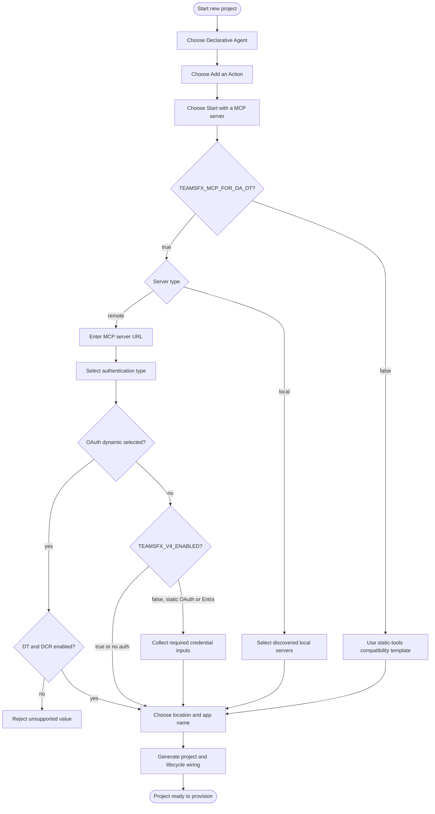

# Create Declarative Agent With MCP Server

## Metadata

- Created: 2026-05-20T00:00:00Z
- Last updated: 2026-07-17T00:00:00Z
- Status: implemented
- PM owner: summzhan
- Engineer owner: HuihuiWu-Microsoft, Alive-Fish
- Scenario group: da
- Scenario ID: SCN-DA-CREATE-WITH-MCP-SERVER
- Primary goal: create
- Start state: No project choice has been made; the developer can start the new project flow and choose `Declarative Agent`.
- Success state: The generated DA project contains the selected local MCP configuration or a remote MCP action, the declarative agent reference, and the lifecycle wiring needed to provision and run it.
- Lifecycle phases: [create]
- Visual/state reference: create-da-with-mcp-server.html

## Scenario

A developer creates a Declarative Agent project backed by a local or remote MCP server. For a remote server, the developer provides the server URL and selects `OAuth (with static registration)`, `OAuth (with dynamic registration)`, `Entra SSO`, or `None`. For a local server, the developer selects one or more servers discovered on the machine and does not provide remote authentication details.

Dynamic Tool Discovery is the default behavior. The generated remote action points at the MCP server and lets the agent host discover tools at runtime; scaffolding does not fetch or freeze a static tool list.

The shipped v3 engine and the v4 preview template implement that same user goal with the same runtime shape: both omit `mcp_tool_description` and `enable_dynamic_discovery` and leave `functions` empty, selecting the host's default dynamic-discovery behavior. They currently differ in credential flow: shipped v3 collects static OAuth or Entra credentials during create and persists environment references for provision, while v4 defers those credential questions to the existing provision-time middleware. These are implementation variants of this Scenario ID, not separate product scenarios.

While `TEAMSFX_MCP_FOR_DA_DT` still exists, setting it to `false` selects the compatibility path documented by [`create-mcp-server-static.md`](../../../03-specs/scenarios/da/create-mcp-server-static.md). That path materializes a static tools list. It remains supported until the feature flag and its routed implementation are removed.

## Dependencies

- Produces a standard DA project, including the app manifest, declarative agent manifest, action manifest, lifecycle files, `.vscode/mcp.json`, environment file, and evaluation assets.
- Remote servers must expose a valid MCP URL. Dynamic OAuth additionally depends on compatible authorization discovery for Dynamic Client Registration.
- Local server choices come from the installed local MCP server provider. No remote URL or auth question is shown for a local choice.
- Provision owns cloud-side OAuth registration. Credential collection happens during shipped v3 create, while the v4 preview defers missing static OAuth or Entra values to provision.

## Feature flags

- `TEAMSFX_MCP_FOR_DA_DT` defaults to `true`. When true, create uses dynamic discovery; the v4 implementation is the `da/mcp-server` template. When false, create retains the static-tools compatibility behavior, implemented by `da/mcp-server-static` in v4.
- `TEAMSFX_MCP_FOR_DA_DCR` defaults to `true`. `OAuth (with dynamic registration)` is visible and accepted only when both DT and DCR are true.
- `TEAMSFX_V4_ENABLED` defaults to `false`. The shipped v3 and v4 preview differences are called out below; the generated question-walk review is explicitly projected from the v4 preview template.
- These flags describe temporary rollout states, not separate product scenarios. Remove the DT-off state from this contract only after its feature flag and implementation route are deleted.

## Surfaces

- VS Code: guided Quick Pick and input-box flow.
- CLI interactive: prompt-driven `atk new` flow with the same template and conditional question model.
- CLI non-interactive: flag-driven `atk new` flow. A remote server requires the MCP server URL and auth type together with the standard capability, app-name, and folder inputs. `oauth-dynamic` is rejected when either DT or DCR is false.
- Visual Studio and chat: not covered by this scenario.

## States

- Entry: the developer starts project creation and chooses `Declarative Agent` -> `Add an Action` -> `Start with a MCP server`.
- Server source: when local discovery is available, the developer chooses `Local MCP server` or `Remote MCP server`; otherwise the flow continues with remote.
- Local: the developer selects one or more discovered local servers. The flow skips URL and authentication questions.
- Remote: the developer enters a valid MCP server URL and selects an authentication type.
- Remote auth: `OAuth (with static registration)`, `Entra SSO`, and `None` are always available on the dynamic route. `OAuth (with dynamic registration)` is available only when both DT and DCR are true.
- Static OAuth and Entra SSO: shipped v3 asks for the required client ID, the OAuth client secret, and optional OAuth scopes during create, then persists environment references for provision. The v4 preview writes auth registration wiring without credential values and asks for missing values during provision.
- Dynamic OAuth: scaffolding injects `dcr/register`. If authorization discovery cannot be resolved, the generated action contains the documented well-known URL placeholder and the developer receives a warning to repair it before provision.
- DT-off compatibility: the selector routes to the static template, which fetches or loads tools and writes the static action shape.
- Validation: invalid URL, app name, location, unsupported auth value, or missing non-interactive input keeps the flow recoverable and does not accept partial output.
- Cancellation: cancelling before generation leaves no partially scaffolded project.

## User-visible outputs

### File changes

- `appPackage/manifest.json`, `appPackage/declarativeAgent.json`, and the standard DA assets are created.
- On the default remote path, `appPackage/ai-plugin.json` contains a URL-derived namespace and a `RemoteMCPServer` runtime with `spec.url` and `run_for_functions: ["*"]`. Both shipped v3 and the v4 preview omit `mcp_tool_description` and `enable_dynamic_discovery`. Neither path creates a static MCP tools file.
- `.vscode/mcp.json` contains the remote server entry. For a local selection, it instead contains the selected `stdio` server definitions and the action manifest has no remote runtime.
- `m365agents.yml` receives `oauth/register` for static OAuth or Entra SSO, `dcr/register` for dynamic OAuth, and no auth registration action for `None` or a local server.
- For static OAuth and Entra SSO, the shipped v3 path writes `MCP_DA_OAUTH_CLIENT_ID_<NS>` to `env/.env.<env>`, writes the OAuth secret as `SECRET_MCP_DA_OAUTH_CLIENT_SECRET_<NS>` to the user environment file, and writes `MCP_DA_OAUTH_SCOPE_<NS>` only when scopes were entered. Its `oauth/register` action references those names. The v4 preview writes only the deterministic `MCP_DA_AUTH_ID_<NS>=` registration-result placeholder and no credential values or references.
- With DT off, the static compatibility template creates the static tools artifact and populated function selection described by its engineering spec.

### Notifications and prompts

- The guided flow shows the DA template choices, MCP source, conditional local selection or remote URL, conditional auth type, project location, and app name. Shipped v3 also shows the conditional credential follow-ups for static OAuth and Entra SSO; the generated v4 preview walk omits them.
- Dynamic OAuth discovery fallback produces a warning identifying the manual repair needed before provision.
- Successful generation opens or reports the generated project through the normal surface behavior.

### Error and recovery messages

- Invalid user input and unavailable target locations produce a correctable validation error before files are accepted.
- A non-empty target fails before rendering and writes nothing.
- Cancelling a picker or input exits without a partial project.

### Environment and secret writes

- Shipped v3 stores the entered client ID and optional scopes in the regular environment file and stores the OAuth client secret through the encrypted user-environment path. It does not log or write the secret to the regular environment file.
- In the v4 preview, create writes no credential values; on first provision, `oauth/register` asks for missing static OAuth or Entra values and writes the resulting configuration ID to `MCP_DA_AUTH_ID_<NS>`.
- Dynamic registration asks for no static client ID, client secret, or scopes.

### External side effects

- Local selection reads the discovered local MCP server catalog.
- Remote auth wiring may probe authorization discovery endpoints while generating the lifecycle action. OAuth configuration creation and DCR execution occur during provision, not scaffolding.

## Flow



## Validation notes

- Three VS Code vscuse remote cases trace to `SCN-DA-CREATE-WITH-MCP-SERVER` for None, static OAuth, and Entra SSO. Local server selection, input recovery, cancellation, and explicit dynamic-registration selection remain L3 validation targets.
- Existing CLI E2E files carry the same Scenario ID and cover dynamic no-auth creation plus the DT-off static tools-file variant. Their public no-auth server cannot validate real auth injection, and they do not currently cover DCR choice gating.
- Engineering acceptance criteria for the default dynamic route are in [`create-mcp-server.md`](../../../03-specs/scenarios/da/create-mcp-server.md).
- DT-off compatibility criteria remain in [`create-mcp-server-static.md`](../../../03-specs/scenarios/da/create-mcp-server-static.md) until the DT flag is removed.
- Shipped v3 tests own create-time credential collection, encrypted secret persistence, and environment-reference injection. V4 scenario tests own the no-credential scaffold output and provision-time handoff.

## Implementation binding

```yaml
version: 1
scaffolding:
  kind: create
  templateIds:
    - da/mcp-server
  reviewContexts:
    - id: vscode-remote-dcr-defaults
      surface: vscode
      environmentProfile: vscode-v4-preview
      featureFlags: {}
      answers:
        projectType: copilot-agent-type
        daTemplate: add-action
        actionSource: mcp
        mcpServerType: remote
        mcpServerUrl: https://example.com/mcp
        authType: oauth-dynamic
    - id: vscode-remote-static-oauth
      surface: vscode
      environmentProfile: vscode-v4-preview
      featureFlags: {}
      answers:
        projectType: copilot-agent-type
        daTemplate: add-action
        actionSource: mcp
        mcpServerType: remote
        mcpServerUrl: https://example.com/mcp
        authType: oauth
    - id: vscode-remote-entra-sso
      surface: vscode
      environmentProfile: vscode-v4-preview
      featureFlags: {}
      answers:
        projectType: copilot-agent-type
        daTemplate: add-action
        actionSource: mcp
        mcpServerType: remote
        mcpServerUrl: https://example.com/mcp
        authType: entra-sso
    - id: vscode-remote-none
      surface: vscode
      environmentProfile: vscode-v4-preview
      featureFlags: {}
      answers:
        projectType: copilot-agent-type
        daTemplate: add-action
        actionSource: mcp
        mcpServerType: remote
        mcpServerUrl: https://example.com/mcp
        authType: none
    - id: vscode-local
      surface: vscode
      environmentProfile: vscode-v4-preview
      featureFlags: {}
      answers:
        projectType: copilot-agent-type
        daTemplate: add-action
        actionSource: mcp
        mcpServerType: local
        selectedLocalServers:
          - local-server
    - id: cli-remote-none
      surface: cli
      environmentProfile: cli-v4-preview
      featureFlags: {}
      answers:
        projectType: copilot-agent-type
        daTemplate: add-action
        actionSource: mcp
        mcpServerType: remote
        mcpServerUrl: https://example.com/mcp
        authType: none
  reviewedFingerprints:
    semantic: 8c5a9d01a93a4ebba76d60a9407356ab7bb999379a7134b0ac0ab674e0882846
    presentation: ba4af976a2266c3d20be8149dfb2b1d8eccadaa9e82361de887c5be47f8ae367
```
