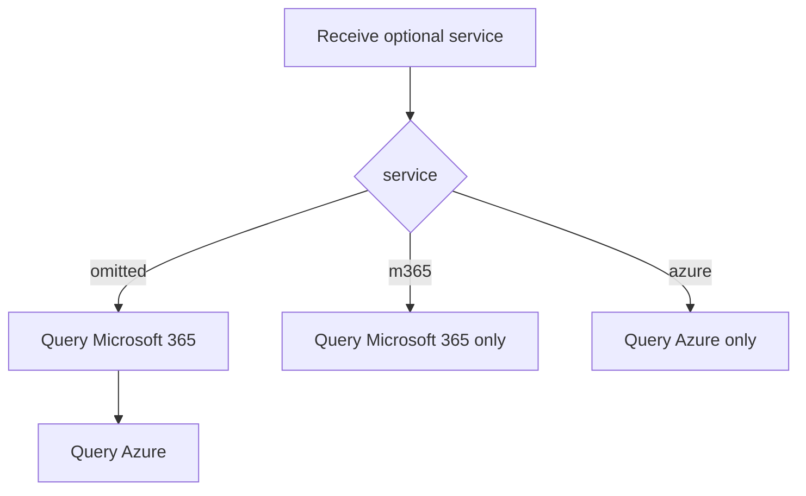

# List Account Status

- **Status:** Approved
- **Domain:** Authentication
- **Owner:** Microsoft 365 Agents Toolkit maintainers
- **Requirement source:** WIQD CI/CD investigation for `gim-home/wiqd#1490`
- **Product impact:** Existing `atk auth list` behavior remains unchanged; callers may limit the
  status lookup to Microsoft 365 or Azure.

## Purpose

Report authentication status without consulting an unrelated account provider. This allows
non-interactive callers that require only Microsoft 365 authentication to avoid Azure status
work and any Azure authentication side effects.

## Inputs

| Input   | Type              | Required | Description                                     |
| ------- | ----------------- | -------: | ----------------------------------------------- |
| service | `m365` \| `azure` |       no | Account provider whose status should be listed. |

## Outputs

The command displays status information for the requested provider. When `service` is omitted,
the command displays both providers in the existing Microsoft 365-then-Azure order.

## Acceptance Criteria

| ID              | Runtime | Purpose               | Gate     | Harness           | Given                                            | When                               | Then                                                                                      |
| --------------- | ------- | --------------------- | -------- | ----------------- | ------------------------------------------------ | ---------------------------------- | ----------------------------------------------------------------------------------------- |
| AUTH-LIST-AC-01 | L1      | operation-integration | required | CliCommandHarness | No service is supplied                           | `atk auth list` runs               | Microsoft 365 and Azure status are both queried, preserving existing behavior and order.  |
| AUTH-LIST-AC-02 | L1      | operation-integration | required | CliCommandHarness | `m365` is supplied                               | The command runs                   | Only Microsoft 365 status is queried; no Azure provider method is called.                 |
| AUTH-LIST-AC-03 | L1      | operation-integration | required | CliCommandHarness | `azure` is supplied                              | The command runs                   | Only Azure status is queried; no Microsoft 365 provider method is called.                 |
| AUTH-LIST-AC-04 | L1      | operation-integration | required | CliCommandHarness | A value other than `m365` or `azure` is supplied | Argument parsing runs              | The command rejects the value before invoking either provider.                            |
| AUTH-LIST-AC-05 | L2      | CLI-E2E               | tracked  | cli-matrix        | M365 username/password CI credentials exist      | `atk auth list m365 -i false` runs | The command completes without displaying an Azure or interactive authentication prompt.   |
| AUTH-LIST-AC-06 | L1      | operation-integration | required | CliCommandHarness | The requested `m365` account is signed out       | `atk auth list m365` runs          | The guidance names only `atk auth login m365`; it does not mention Azure login.           |
| AUTH-LIST-AC-07 | L1      | operation-integration | required | CliCommandHarness | The requested `azure` account is signed out      | `atk auth list azure` runs         | The guidance names only `atk auth login azure`; it does not mention Microsoft 365 login.  |
| AUTH-LIST-AC-08 | L1      | operation-integration | required | CliCommandHarness | A service positional argument is supplied        | `atk auth list <service>` runs     | Status mode is non-interactive by default, so the CLI preserves and applies the argument. |

## Flow

## Boundary

This operation does not change login, logout, token acquisition, credential storage, or the
default output of `atk auth list`. It does not repair provider-specific status implementations;
it prevents an unrequested provider from participating in a scoped status lookup.

## Invariants

1. Omitting `service` preserves the existing two-provider behavior and ordering.
2. A scoped status lookup never invokes methods on the unrequested provider.
3. Status lookup remains non-interactive when `-i false` is supplied.
4. Only `m365` and `azure` are accepted service values.
5. Signed-out guidance is scoped to the requested provider; unscoped guidance continues to name
   both providers.
6. Account status is non-interactive by default so positional service arguments are not discarded
   by the interactive command engine.
