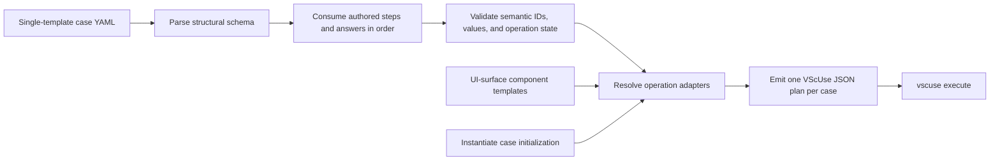

# Operation — `compile-vscuse-case-bundles`

- **Status:** Implemented
- **Product behavior change:** none; this operation defines test sources and generates VscUse plans.
- **Related contracts:** [scenario model](../../../01-product/scenarios/README.md),
  [`inspect-scaffold-catalog`](../scaffolding/inspect-scaffold-catalog.md)

## Purpose

Define several validation cases for exactly one template in one concise YAML file. Reusable atomic
steps are defined once at the file level, while every case explicitly owns its ordered step
references. The YAML is the reviewable source of truth; a compiler adapts the authored semantic
question IDs, option IDs, accounts, lifecycle inputs, and launch titles to reusable UI components,
then emits one existing-format VscUse JSON plan per case. The VscUse runner, recordings,
screenshots, and shared groups remain unchanged.

## Decision

| Option                                      | Decision     | Reason                                                                                  |
| ------------------------------------------- | ------------ | --------------------------------------------------------------------------------------- |
| Make YAML a native VscUse runner format     | Rejected     | Requires changing the external runner and duplicates its plan model.                    |
| Compile semantic YAML to current JSON plans | **Selected** | Reuses UI components, recorded interactions, variables, and current CI.                 |
| Put VscUse group IDs directly in YAML       | Rejected     | Group filenames and plan IDs are implementation details and already vary across cases.  |
| Inherit one file-level execution sequence   | Rejected     | Hides each case's actual behavior and conflates reusable definitions with control flow. |
| Define reusable multi-step sequence macros  | Rejected     | Adds nested control flow when named atomic steps provide sufficient reuse.              |

## Current Implementation Limits

The root object, case objects, and semantic step-definition objects are closed schemas. Check
assertions, check expectations, provision input groups, and `deploy.with` are also closed by their
semantic adapters. Other nested `with` objects are currently consumed field by field rather than
rejected for every unknown field. In particular, the compiler currently accepts an empty scaffold
`answers` array, an empty non-initial `checks.with` array, and unused nested fields on login,
target, and open definitions. Authors must not rely on those accepted-but-unused
values; complete nested closure remains follow-up validation work.

Text answers generally accept any string. `appName` is the exception: it must use an expression
that initializes `app_name` with one Linux workspace path segment, such as
`${{var:app_name:vscuse_app_#####}}`, because mandatory workspace checks and later adapters
reference `${{var:app_name}}`. Literal, unresolved, absolute, and path-like app names fail
compilation.

The compiler validates known question IDs, option IDs, answer types, value shapes, duplicate
questions, and secret expressions, and it preserves authored answer order. It does not maintain a
per-template question graph, so it cannot prove that an authored selector path is complete or that
all conditional questions are in the correct order. The generated prompt assertions detect an
incorrect path at execution time. Parser and structural diagnostics include a source path and YAML
path and may be aggregated; semantic adapter compilation currently stops at the first error and
returns only a stable code and redacted message.

## YAML Contract

```yaml
version: 1

steps:
  scaffold-ts:
    type: scaffold
    with:
      template: weather-agent
      answers:
        - question: projectType
          value: custom-engine-agent-type
        - question: customEngineAgent
          value: weather-agent
        - question: llmService
          value: llm-service-azure-openai
        - question: azureOpenAIKey
          type: text
          value: "${{secret:AZURE_OPENAI_API_KEY}}"
        - question: azureOpenAIEndpoint
          type: text
          value: "${{env:AZURE_OPENAI_ENDPOINT}}"
        - question: azureOpenAIDeploymentName
          type: text
          value: "${{env:AZURE_OPENAI_MODEL}}"
        - question: language
          value: typescript

  check-scaffold:
    type: checks
    with:
      - type: file
        path: m365agents.yml
        expect:
          exists: true
          contains: ["provision:", "deploy:"]
          notContains: ["oauth/register"]
      - type: file
        path: appPackage/manifest.json
        expect:
          exists: true

  login-azure:
    type: login
    with:
      type: azure
      account: "${{env:AZURE_ACCOUNT_NAME}}"
      password: "${{secret:AZURE_ACCOUNT_PASSWORD}}"

  login-m365:
    type: login
    with:
      type: m365
      account: "${{env:M365_ACCOUNT_NAME}}"
      password: "${{secret:M365_ACCOUNT_PASSWORD}}"

  provision-arm:
    type: provision
    with:
      arm:
        subscriptionId: "${{env:AZURE_SUBSCRIPTION_ID}}"
        targetResourceGroupName: "+ New resource group"
        newResourceGroupName: "${{var:app_name}}-rg"
        newResourceGroupLocation: "${{env:RESOURCE_GROUP_REGION}}"

  deploy:
    type: deploy

  remote-preview:
    type: target
    with:
      profile: "Launch Remote in Teams (Chrome)"

  open-app:
    type: open
    with: { kind: app, destination: chat }

  check-remote-preview:
    type: checks
    with:
      - type: chat
        send: What is the weather in Seattle?
        expect:
          replied: true
          contains: [Seattle]

cases:
  - id: weather-ts-remote
    scenarioId: SCN-TEAMS-WEATHER-REMOTE-PREVIEW
    steps:
      - scaffold-ts
      - check-scaffold
      - login-azure
      - login-m365
      - provision-arm
      - deploy
      - remote-preview
      - open-app
      - check-remote-preview
```

The example scenario ID identifies the target behavior as the case's primary validation goal;
scaffold, login, provision, and deploy may be setup for that goal. The current compiler preserves
this required ID in generated metadata but does not yet resolve it against the scenario documents.

`bundleId` is intentionally absent. Its original purpose was to identify the source file and its
generated outputs, but the repository-relative YAML path already provides that identity. Generated
plan filenames use `<normalized-scaffold-template>--<case-id>.json`, so another authored ID would
only duplicate information.

## Field Semantics

| Field                                                   | Rule                                                                                                                                                                                                                                  |
| ------------------------------------------------------- | ------------------------------------------------------------------------------------------------------------------------------------------------------------------------------------------------------------------------------------- |
| `version`                                               | Required; first version is `1`.                                                                                                                                                                                                       |
| `featureFlags`                                          | Optional non-empty list of unique `NAME=true` or `NAME=false` compatibility switches, emitted as `feature_flag:` plan metadata.                                                                                                       |
| `steps`                                                 | Required non-empty map of unique step names to atomic semantic step definitions.                                                                                                                                                      |
| `steps.<name>.type`                                     | Required; one of `scaffold`, `login`, `provision`, `deploy`, `target`, `open`, or `checks`.                                                                                                                                           |
| `steps.<name>.with`                                     | Step-local input consumed by the definition's semantic adapter. Provision and check inputs are closed; see current implementation limits for other nested objects.                                                                    |
| `cases`                                                 | One or more explicit cases for the file's single scaffold template. V1 has no matrix expansion.                                                                                                                                       |
| `case.id`                                               | Required and unique within the file. Combined with the resolved scaffold template for the generated plan name.                                                                                                                        |
| `case.scenarioId`                                       | Required non-empty product/engineering Scenario ID; copied to generated metadata without current doc lookup.                                                                                                                          |
| `case.steps`                                            | Required ordered references containing exactly one `scaffold`. Inline definitions and overrides are invalid.                                                                                                                          |
| `case.gate`                                             | Optional execution gate: `pr`, `scheduled`, or `manual`; default is `pr`.                                                                                                                                                             |
| `scaffold.with.template`                                | Required stable v4 template ID, such as `weather-agent`.                                                                                                                                                                              |
| `scaffold.with.answers`                                 | Required ordered array of `{ question, type?, value }` entries representing the executed prompt path. Current validation permits an empty array.                                                                                      |
| `answers[].question`                                    | Stable selector or create-question key. Each key may occur at most once in one scaffold definition.                                                                                                                                   |
| `answers[].type`                                        | Optional UI type: `singleSelect`, `multiSelect`, or `text`; defaults to `singleSelect`.                                                                                                                                               |
| `answers[].value`                                       | One supported option ID, a non-empty option-ID list, or a string compatible with the authored question type. Secret questions require `${{secret:NAME}}`.                                                                             |
| `login.with.type`                                       | Required provider for this login step: `azure` or `m365`.                                                                                                                                                                             |
| `login.with.account`                                    | Required `${{env:NAME}}` expression identifying the exact account used by the selected provider recipe.                                                                                                                               |
| `login.with.password`                                   | Required `${{secret:NAME}}` expression for the selected account.                                                                                                                                                                      |
| `file.path`                                             | Required workspace-relative path to one generated file.                                                                                                                                                                               |
| `file.expect.exists`                                    | Optional boolean. `false` asserts absence and cannot be combined with content expectations.                                                                                                                                           |
| `file.expect.contains`                                  | Optional non-empty list of literal UTF-8 substrings that must all occur.                                                                                                                                                              |
| `file.expect.notContains`                               | Optional non-empty list of literal UTF-8 substrings that must all be absent.                                                                                                                                                          |
| `provision.with.arm`                                    | Presence means Azure resources are required. Keys come from the operation-owned ARM question set below.                                                                                                                               |
| `provision.with.apiKey`                                 | API-key value as a required `${{secret:NAME}}` expression; supported only by the existing-API template adapter.                                                                                                                       |
| `provision.with.oauth`                                  | Existing-API OAuth credentials: `clientId` uses `${{env:NAME}}`; `clientSecret` uses `${{secret:NAME}}`.                                                                                                                              |
| `provision.with.environment`, `deploy.with.environment` | Optional literal `none`, declaring that the project exposes a single selectable environment so the toolkit auto-selects it and shows no picker. Orthogonal to the input groups above; omitting it emits the recorded `dev` selection. |
| `target.with.profile`                                   | Required for every `target`; the exact launch-configuration title visible in the VS Code F5 picker.                                                                                                                                   |
| `open.with.kind`                                        | Required activation object: `app` or `agent`.                                                                                                                                                                                         |
| `open.with.destination`                                 | Required converged destination: `chat` or `page`.                                                                                                                                                                                     |
| `chat.send`                                             | Required string sent as one user turn through the active target's chat adapter. Authors should use a non-empty message; current validation permits an empty string.                                                                   |
| `chat.allowAction`                                      | Optional literal `true`; after a Copilot message, accepts the deterministic capability-consent prompt.                                                                                                                                |
| `chat.expect`                                           | Optional for `chat` only; omitting it sends the message without asserting the reply so a later assertion can observe the surface the message produced.                                                                                |
| `chat.expect.replied`                                   | Optional boolean. `true` requires one completed, non-empty assistant response; `false` emits no response assertion.                                                                                                                   |
| `chat.expect.contains`                                  | Optional non-empty list of literal visible substrings that must all occur in the completed response.                                                                                                                                  |
| `chat.expect.notContains`                               | Optional non-empty list of literal visible substrings that must all be absent from the completed response.                                                                                                                            |
| `browser.expect.role`                                   | Required non-empty accessible role for an element visible after a target operation.                                                                                                                                                   |
| `browser.expect.name`                                   | Required non-empty accessible name for that visible browser element.                                                                                                                                                                  |

Step definitions own all authored operation input. A case owns only case metadata and the ordered
names of the definitions it executes. Definitions are atomic: they cannot reference other steps or
expand into a sequence. A definition may be referenced by multiple cases or repeated within one
case. A case cannot change a referenced definition; when two cases need different input, the file
declares two named definitions, such as `scaffold-ts` and `scaffold-js`.

## Step Semantics

The file-level `steps` map owns reusable atomic definitions; each `case.steps` list owns control
flow. A definition is an object with a semantic `type` and optional type-specific fields:

```yaml
steps:
  scaffold-ts:
    type: scaffold
    with:
      template: weather-agent
      answers:
        - { question: projectType, value: custom-engine-agent-type }
        - { question: customEngineAgent, value: weather-agent }
        - { question: llmService, value: llm-service-azure-openai }
        - { question: language, value: typescript }
  check-scaffold:
    type: checks
    with:
      - type: file
        path: m365agents.yml
        expect:
          exists: true
          contains: ["provision:"]
          notContains: ["oauth/register"]
  remote-preview:
    type: target
    with: { profile: "Launch Remote in Teams (Chrome)" }
  open-app:
    type: open
    with: { kind: app, destination: chat }
  check-remote-preview:
    type: checks
    with:
      - type: chat
        send: What is the weather tomorrow?
        expect:
          replied: true
          contains: [weather]

cases:
  - id: weather-remote
    scenarioId: SCN-TEAMS-WEATHER-REMOTE-PREVIEW
    steps:
      [
        scaffold-ts,
        check-scaffold,
        remote-preview,
        open-app,
        check-remote-preview,
      ]
```

V1 step types are `scaffold`, `login`, `provision`, `deploy`, `target`, `open`, and `checks`.
`scaffold` accepts `template` and `answers`; `login`, `provision`, and `target` accept their
same-named operation input. `deploy` has no semantic input, although current validation ignores an
authored `with` object. `open` requires `with.kind` and
`with.destination`; the current template, target profile, and those two values select a compatible
adapter. The profile already identifies the host surface, so `open` does not repeat Teams or
Copilot as authored input. A future Playground target adapter can follow the same rule.

A `checks` definition requires a `with` array. The check immediately following `scaffold` must
contain at least one `file` assertion; current validation permits a later `checks` definition to be
empty. Each assertion selects its adapter and required runtime state by `type`; there is no
separate check context field:

- `file` uses the generated workspace and requires a successful preceding `scaffold`. It requires
  one workspace-relative `path` and a non-empty `expect` object. `expect.exists` accepts a boolean;
  `expect.contains` and `expect.notContains` are non-empty lists of literal substrings. At least one
  expectation is required, content expectations imply `exists: true`, and `exists: false` cannot be
  combined with either content expectation.
- `browser` requires a preceding `target` and asserts one visible element by its accessible `role`
  and `name`. It does not expose coordinates, selectors, screenshots, or free-form source tags.
- `chat` uses the current target's chat adapter and requires `chat-ready` state. A preceding `open`
  establishes that state for the current Teams or Copilot profile. `allowAction: true` is supported
  only by the Copilot adapter after a capability-producing message; it accepts exactly one recorded
  consent prompt before response assertions. When `expect` is present, one or more of
  `expect.replied`, `expect.contains`, or `expect.notContains` is required, and content
  expectations imply `replied: true`. Omitting `expect` sends the message and asserts nothing about
  the reply, which lets a following assertion observe the surface the message produced — for example
  the sign-in button an OAuth-protected plugin raises instead of an answer.

Assertions execute in their authored array order. A `checks` definition may combine assertion
types only when every assertion's required runtime state exists at that position in the case. The
closed schema rejects `checks.on` and unknown assertion types.

File content is decoded as UTF-8 and matched as authored without trimming or case folding. Every
`contains` value must occur; every `notContains` value must be absent. Invalid UTF-8, a missing file,
or a failed content assertion fails the check. Absolute paths and paths escaping the generated
workspace are rejected before execution. Diagnostics identify the path and failed expectation but
never include the file contents.

Referenced definitions execute exactly in each case's authored order and may repeat. The compiler
validates operation preconditions rather than silently reordering them: every case references
exactly one `scaffold`; it must be immediately followed by a `checks` definition containing at
least one `file` assertion; other workspace-dependent steps require that pair to succeed; ARM
provision requires a preceding Azure login; a target requires every compatible login and lifecycle
operation declared by its launch profile; and `chat` assertions require a successful
preceding `target`. An `open` requires that target and must appear before any assertion whose
required state it establishes. A `chat` assertion is rejected unless the preceding sequence has
reached `chat-ready`.

`target` is one authored F5 operation that selects and starts its declared launch profile. The
current adapters support `Launch Remote in Teams (Chrome)` and `Preview in Copilot (Chrome)`; any
other exact title fails until a deterministic adapter is added. The
authored `profile` is the exact case-sensitive `name` shown in the F5 picker after template rendering;
it is not a compiler-defined semantic ID. For example, the TypeScript Weather template authors
`Launch Remote in Teams (Chrome)`. A Python profile titled `Launch Remote (Chrome)` is currently
unsupported because no semantic target adapter is registered for that exact title.
A selected profile's `preLaunchTask` may validate prerequisites, create local debug state, start the
tunnel, provision and deploy locally, and start the application. Those profile-owned tasks are not
duplicated as case step references. A profile without lifecycle prelaunch tasks instead requires the
explicit preceding lifecycle definitions, such as `provision` or `deploy`, required by its semantic
adapter.

`open` is a separate convergent operation over the current target. `kind` identifies whether the
surface activates an `app` or an `agent`; `destination` identifies whether success must produce
`chat-ready` or `page-ready`; current adapters support only `chat-ready`. The compiler selects a compatible adapter for one supported,
deterministic entry state, then verifies the requested destination state. An unsupported state,
including direct Teams Open, an already-active Teams experience, Copilot agent selection, or a
permission prompt, fails adapter resolution until an isolated recording proves its transition.
UI labels, selectors, transient actions, and the difference between DA and CEA surfaces remain in
the selected open adapter rather than in case YAML.

For example, a case can reference the same chat-check definition twice after one target/open
sequence without exposing its recorded UI operations:

```yaml
steps:
  open-app:
    type: open
    with: { kind: app, destination: chat }
  check-weather:
    type: checks
    with:
      - type: chat
        send: What is the weather in Seattle?
        expect: { replied: true, contains: [Seattle] }

cases:
  - id: weather-two-turn
    scenarioId: SCN-TEAMS-WEATHER-REMOTE-PREVIEW
    steps:
      - scaffold-ts
      - check-scaffold
      - remote-preview
      - open-app
      - check-weather
      - check-weather
```

The current Copilot target definition is:

```yaml
remote-preview-da:
  type: target
  with: { profile: "Preview in Copilot (Chrome)" }
```

An explicit open definition declares the semantic object and desired destination, not the current
UI action:

```yaml
open-agent:
  type: open
  with:
    kind: agent
    destination: chat
```

Every scaffold definition in one source file must declare the same `template`. Its `answers` list
should explicitly include the complete selector path before the selected template's create questions.
For `weather-agent`, the list starts with `projectType: custom-engine-agent-type` and
`customEngineAgent: weather-agent`, which emit `New Project` → `Custom Engine Agent` and
`App Features Using Microsoft 365 Agents SDK` → `Weather Agent`. V1 does not reverse-resolve a
selector path from `template`; the authored selector answers are the source of execution order.

Authored `answers` are an ordered list of stable question keys, UI types, and values. The
optional `type` defaults to `singleSelect`; the V1 closed set is `singleSelect`, `multiSelect`, and
`text`. A single-select requires one option ID, a multi-select requires a non-empty array of unique
option IDs, and text accepts a literal, `${{env:NAME}}`, `${{var:app_name}}`, or
`${{secret:NAME}}`. The authored type must equal the semantic adapter's supported type after
applying the default. Unsupported types and value shapes are errors. The compiler consumes entries
exactly in authored order and resolves each question key to its canonical `en-US` visible title and
each option ID to its visible label. Every valid authored entry represents one prompted question
and emits one logical answer expansion. A multi-select expansion contains one component per option
plus one confirmation component. The compiler does not load or maintain a second per-template
question graph, infer omitted questions, or reorder answers.

For `da/mcp-server`, cases explicitly author the observed conditional path: `authType: oauth` is
followed by `mcp-da-client-id`, `mcp-da-client-secret`, and optional `mcp-da-scopes`, while
`authType: entra-sso` is followed only by `mcp-da-client-id`; `none` has no credential follow-up.
Prior authored answers may select a visible-label variant, such as the Entra client ID prompt.
Password follow-ups such as `mcp-da-client-secret` require a secret expression.

V1 semantic adapters and component assertions use an `en-US` locale snapshot, so execution requires
the VScUse runner and product UI to use `en-US`. This compiler does not configure or enforce the
runner locale. Unknown or duplicate question keys and unknown option IDs fail compilation.
Runtime-discovered values without a deterministic component remain unsupported; in particular,
local MCP server IDs are unsupported until a test-owned interaction exists. The compiler does not
use the template ID to discover, insert, validate, or reorder selector answers, so selector-path
completeness is verified by generated UI assertions at execution time. Password questions require
a secret expression; their literal values are invalid.

`language` is an authored question key when the template supports multiple languages; the compiler
emits it as `Programming Language` and resolves IDs such as `typescript` to labels such as
`TypeScript`. Application name and project location are also authored answers, using the `appName`
and `workspaceFolder` question keys. Current cases use `workspaceFolder: default` and
`${{var:app_name:vscuse_app_#####}}` for `appName`, which initializes the reusable `app_name`
variable. The initializer default must be one segment containing only letters, digits, `_`, `-`,
or `#`. External/non-v4 selector routes are unsupported in V1.

## UI Component Directory Contract

Reusable VScUse templates are organized by the VS Code UI surface they automate rather than by
the product operation that consumes them:

```text
components/
  authentication/
    browser/
      m365-sign-in.json.tpl
    open-account-menu.json.tpl
    azure/
      sign-in.json.tpl
    m365/
      sign-in.json.tpl
  browser/
    assert-element.json.tpl
    assert-ready.json.tpl
    chat/
      assert-contains.json.tpl
      assert-not-contains.json.tpl
      assert-replied.json.tpl
    copilot/
      allow-action.json.tpl
      send-message.json.tpl
    playground/
      send-message.json.tpl
    teams/
      add-and-open-app.json.tpl
      send-message.json.tpl
  command-palette/
    execute-command.json.tpl
  checks/
    workspace-file.json.tpl
  dialog/
    click-primary-action.json.tpl
  initialization/
    assert-toolkit-view-settled.json.tpl
    close-welcome-overlay.json.tpl
  notifications/
    assert-contains.json.tpl
  quick-input/
    click-option.json.tpl
    confirm.json.tpl
    confirm-option.json.tpl
    filter-option.json.tpl
    multi-select.json.tpl
    multi-select-confirm.json.tpl
    single-select.json.tpl
    text.json.tpl
```

Product operations compose these generic UI components through compiler-owned adapters. Component
paths, low-level tools, command titles, assertions, and interaction details never enter semantic
case YAML.

## Browser Component Contract

Browser components implement `open` and `chat` adapters without exposing host controls in semantic
case YAML. Open components converge one deterministic entry state to the requested readiness
state. Chat components start from `chat-ready`, submit one message through the current host, and
apply host-neutral assertions to the resulting assistant response. V1 includes:

| Operation | Host surface | Entry state           | Component file                      | Converged state      |
| --------- | ------------ | --------------------- | ----------------------------------- | -------------------- |
| `open`    | Any          | Already ready         | `assert-ready.json.tpl`             | Adapter-owned        |
| `open`    | Teams        | Fresh app details/Add | `teams/add-and-open-app.json.tpl`   | `chat-ready`         |
| `chat`    | Teams        | `chat-ready`          | `teams/send-message.json.tpl`       | `message-submitted`  |
| `chat`    | Copilot      | `chat-ready`          | `copilot/send-message.json.tpl`     | `message-submitted`  |
| `chat`    | Copilot      | Consent prompt        | `copilot/allow-action.json.tpl`     | Consent dismissed    |
| `chat`    | Playground   | `chat-ready`          | `playground/send-message.json.tpl`  | `message-submitted`  |
| `browser` | Any          | Target ready          | `assert-element.json.tpl`           | Element visible      |
| `chat`    | Any          | `message-submitted`   | `chat/assert-replied.json.tpl`      | `assistant-response` |
| `chat`    | Any          | `assistant-response`  | `chat/assert-contains.json.tpl`     | `assistant-response` |
| `chat`    | Any          | `assistant-response`  | `chat/assert-not-contains.json.tpl` | `assistant-response` |

`assert-ready.json.tpl` emits only the adapter's semantic readiness assertion. The Teams fresh-app
component asserts that Add is visible, clicks the recorded Add control, asserts that the
"Added successfully!" dialog and Open control are visible, clicks Open, then asserts the requested
chat destination is ready. The generic adapter accepts `readySubject`; the Teams adapter also uses
that parameter for its final assertion while its Add and Added subjects remain fixed. The recorded
coordinates and visual preconditions remain component-owned.

A target profile's `readySubject` names the app by the unique prefix the case authored, as
"an app whose name starts with `${{var:app_name}}`", and tolerates whatever the product appends.
Readiness only has to establish that the app on screen is the one this case scaffolded. Manifests
compose their name as `{{appName}}${{APP_NAME_SUFFIX}}`, but not every template appends that suffix
and the previewed environment decides its value, so a subject that spells out the fully composed
name fails on naming detail rather than on readiness. The post-scaffold file checks already assert
that composition exactly, against the manifest itself rather than against a screenshot, so the
prefix claim loses no coverage. Both readiness components take a complete sentence and append only
a full stop, so a subject reads identically wherever a profile is used.

An adapter template is linear and owns exactly one entry state. It must not use an "Add or Open"
assertion followed by an Add-only sequence, optional steps, or runtime fallback clicks. A test
profile using the fresh-app adapter must guarantee a unique, not-yet-installed app identity. Direct
Open, Teams channel or meeting placement, and Copilot agent selection require their own recorded
components before their entry states can be supported. Each recording must
isolate one entry state, include every required interaction, and finish with an assertion proving
the converged adapter state. Semantic case YAML continues to author only `kind` and `destination`.

Each host `send-message.json.tpl` accepts `instanceSuffix` and `message`. It asserts the host's
message input, clicks the recorded input control, types the message, and presses Enter exactly once.
The Copilot input carries the previewed agent's own name, so its assertion names that input by the
prefix the case authored rather than by the `Message Copilot` placeholder the unscoped Copilot chat
shows. It does not assert response content. For one `chat` check, the compiler emits the current
host's send component, the Copilot `allow-action` component when `allowAction: true`, then
`assert-replied` whenever `replied: true` or a content expectation implies it, followed by one
`assert-contains` per `contains` item and one `assert-not-contains` per `notContains` item. The
consent component asserts the deterministic Allow prompt, clicks its recorded control, and asserts
that the prompt is dismissed. Items preserve their authored list order; the two lists execute in
`contains`, then `notContains` order. This keeps variable-length expectations in compiler
composition rather than adding loops, optional branches, or complete caller-supplied descriptions
to a template.

The Playground message component is not reachable until a compatible target adapter can produce
`chat-ready`; that future adapter may reuse `assert-ready.json.tpl`. The recorded Copilot remote
target converges to an already-active agent chat, so `open` for `kind: agent` and
`destination: chat` emits no step. The target has already asserted this profile's readiness subject
with nothing in between, and repeating that assertion cannot fail unless the target's own assertion
already failed. The operation still declares the destination and kind the case chats in, which
compilation rejects when the profile cannot reach them. The recorded Copilot message-input click
belongs to `send-message`, not `open`. The `allow-action` adapter is limited
to the deterministic consent state reached after a capability-producing Copilot message; it is not
a generic permission fallback.

## Case Initialization Component Contract

Every generated plan begins with exactly one compiler-owned initialization component from
`packages/tests/vscuse/vscode-test-cases/components/initialization/close-welcome-overlay.json.tpl`.
It asserts that the startup "Welcome to VS Code" sign-in overlay and its Close button are visible,
closes that overlay using the recorded visual interaction, then asserts that the overlay is absent
and the VS Code workbench is ready. These generated steps run before the first authored case step
and are not represented in `case.steps`.

The component has no semantic parameters; it accepts only the common `instanceSuffix`. It owns its
recorded click coordinates and visual preconditions as one replaceable interaction unit; a VS Code
layout change requires re-recording the component rather than changing semantic case YAML. V1
requires a fresh runner session with the startup overlay visible and fails initialization when that
precondition is not met. The component does not close the underlying Welcome/Get Started editor or
any project editor.

The scaffold recipe uses a second initialization component,
`initialization/assert-toolkit-view-settled.json.tpl`. It also has no semantic parameters and emits
a single assertion that the toolkit view is open in the side bar and its Get Started editor is
visible in the editor area. It owns no coordinates. The scaffold recipe emits it after the
toolkit-view focus command, because the Get Started editor can still open after that command
returns.

The scaffold recipe then uses a third initialization component,
`initialization/close-get-started-editor.json.tpl`, between that assertion and the create command.
It closes the Get Started editor with `Ctrl+W` and asserts that no editor tab remains open. It has
no semantic parameters and owns no coordinates. The toolkit sets `ignoreFocusOut` on every quick
pick it opens, so a scaffold quick pick that loses keyboard focus stays on screen instead of
dismissing itself. The Get Started editor reclaims focus while the create command is opening its
first quick pick, which leaves that quick pick visible but deaf: its prompt assertion passes and the
filter keystrokes reach the editor instead. Closing the editor removes the competing focus target
rather than racing it. The preceding settled assertion is what makes the close deterministic: it
guarantees the editor exists, so `Ctrl+W` targets it instead of closing the window.

The scaffold recipe ends with a fourth initialization component,
`initialization/assert-project-window-ready.json.tpl`, which asserts that the Preview README.md
editor tab is open. It has no semantic parameters and owns no coordinates. Submitting the last
scaffold answer starts project creation, which reopens the workspace in a new window whose extension
host starts the toolkit again. Every later operation drives toolkit-contributed UI, and the toolkit
registers that UI only once activation sets `fx-extension.isTeamsFx`, so an operation that runs
before activation finishes addresses commands and views that do not exist yet. Nothing else in the
reopened window proves activation: the post-scaffold file checks read the workspace directly, and a
command that registers after the Command Palette has already filtered does not appear in the filtered
list. The toolkit opens that README preview only for a freshly created project and only after
activation, so waiting for it converts the race into a bounded wait.

## Command Palette Component Contract

Any compiler-owned recipe that executes a visible VS Code command uses
`packages/tests/vscuse/vscode-test-cases/components/command-palette/execute-command.json.tpl`.
The component opens the Command Palette with `F1`, asserts that the palette is active,
types the exact canonical `en-US` command title, asserts that exactly one matching command is
visible and selectable, then confirms it with Enter. Its only semantic parameter is `commandTitle`;
assertion sentences are authored directly in the template. It contains no product command,
scaffold, lifecycle, or business question IDs.

The scaffold recipe instantiates this component twice after case initialization and before
the first scaffold quick-input component. It first executes
`Microsoft 365 Agents Toolkit: Focus on Microsoft 365 Agents Toolkit View`, because activating the
toolkit opens its Get Started editor, which keeps keyboard focus and swallows the text typed into
the first scaffold quick pick; focusing the toolkit view parks focus on a tree view instead. It
waits for the toolkit view to settle through the initialization component described above, then
executes `Microsoft 365 Agents: Create New Agent/App`. Both titles are resolved by the compiler's
command adapter; the compiler does not use a TreeView coordinate or provide a TreeView fallback. The
first emitted quick-input assertion verifies that command execution reached the expected first
scaffold question. A command-specific result assertion remains the responsibility of the following
recipe component because the generic command component cannot know the invoked command's result
surface.

## Lifecycle Component Composition Contract

`provision`, `deploy`, and `target` are compiler-owned recipes composed from UI-surface components;
they are not monolithic component templates. Every visible command, including
`Notifications: Show Notifications` and `Debug: Select and Start Debugging`, is executed through
`command-palette/execute-command.json.tpl` and therefore uses F1. Compiler-owned semantic adapters
map stable operation inputs to canonical command titles, prompt titles, option labels, compatible
entry states, and resulting states.

The current evidence-backed recipe shapes are:

| Operation   | Component sequence                                                                                                                                        | Result state                   |
| ----------- | --------------------------------------------------------------------------------------------------------------------------------------------------------- | ------------------------------ |
| `provision` | Execute Provision; emit supported ARM, API-key, or OAuth prompts when authored; use the matching confirmation adapter; show Notifications; assert success | `provisioned`                  |
| `deploy`    | Execute Deploy; confirm the focused Deploy option; show Notifications; assert success                                                                     | `deployed`                     |
| `target`    | Execute Select and Start Debugging; select the exact authored profile; assert the adapter-produced target readiness                                       | Profile-owned target readiness |

`dialog/click-primary-action.json.tpl` accepts `dialogTitle` and `actionLabel`, asserts the
recorded dialog entry state, then presses Enter to activate the asserted primary action. It supports
the registered Provision, API-key, and OAuth confirmation descriptions. `quick-input/confirm.json.tpl`
accepts `questionTitle` and `optionLabel`, asserts that the option is focused, and presses Enter;
its current visual precondition supports the recorded Deploy confirmation state. These components
must not be interchanged or combined through optional steps. A different dialog layout or focus
state requires a separate recorded adapter.

After a lifecycle action starts, the recipe reuses `execute-command.json.tpl` with the canonical
Notifications command, then instantiates `notifications/assert-contains.json.tpl` with the fixed
operation success text from the semantic adapter. The notification template owns its 300-second retry
window; timeout is not semantic YAML input. A recipe with a terminal continuation prompt, such as
`Ok to proceed? (y)`, remains unsupported until a terminal-specific adapter records that entry and
converged state.

A target recipe ends before Teams Add/Open, Copilot selection, or chat activity. A preceding
`login:m365` obtains and stores credentials; the Copilot target adapter uses those credentials for
browser M365 sign-in after launch. When provision prompted for API-key or OAuth credentials, the
target recipe also replays those prompts after profile selection. Semantic activation remains in
`open`, and chat activity remains in `checks`. Existing recorded debug groups that combine these
concerns are evidence sources only and cannot be reused wholesale as target adapters. A target that
launches directly into a ready surface may reuse `browser/assert-ready.json.tpl`; otherwise the
following authored `open` resolves a separate adapter.

## Account Sign-In Component Contract

Azure and Microsoft 365 sign-in recipes first execute
`Microsoft 365 Agents Toolkit: Focus on Accounts View` through
`command-palette/execute-command.json.tpl`. Scaffolding reopens the workspace in a new window whose
side bar defaults to the Explorer, so the toolkit tree view that owns the ACCOUNTS section is not
showing, and the readiness assertion at the end of each adapter reads the signed-in account from
that section.

The title differs from the one case initialization uses because the toolkit contributes one view per
side bar section and VS Code generates a focus command per view, gated on `fx-extension.isTeamsFx`.
An empty workspace shows only the `Microsoft 365 Agents Toolkit` welcome view, and a scaffolded
workspace hides it and shows Accounts, Environment, Development, Lifecycle, Utility, and
Help and feedback instead, so neither title resolves in the other window.

The recipes then instantiate
`authentication/open-account-menu.json.tpl`. The component uses F1, filters by the canonical
command title `Microsoft 365 Agents: Accounts`, asserts the two leading results by the labels VS
Code displays for them, `Microsoft 365 Agents Toolkit: Focus on Accounts View` first and
`Microsoft 365 Agents: Accounts` second, then selects the second result by keyboard to leave the
account menu active. Naming both results literally keeps the assertion readable from a screenshot,
because a paraphrase of a command title is not text the judge can find on screen. It is
account-neutral but
intentionally separate from `execute-command.json.tpl`, whose unique-result contract does not
match this VS Code command surface. The recipe then instantiates exactly one deterministic adapter:

| Account | Adapter                        | Entry state       | Converged state               |
| ------- | ------------------------------ | ----------------- | ----------------------------- |
| Azure   | `authentication/azure/sign-in` | Account menu open | Azure account visible         |
| M365    | `authentication/m365/sign-in`  | Account menu open | Microsoft 365 account visible |

Both adapters accept `accountName` and `accountPassword` in addition to `instanceSuffix`.
`accountName` must be an environment expression and `accountPassword` must be a secret expression;
literal credentials fail compilation. Templates use these values only for browser input and the
non-secret account-name readiness assertion. Password values never appear in descriptions,
assertions, tags, or diagnostics.

Their compatible test profile guarantees that both Toolkit accounts are signed out and the browser
authentication session reaches the recorded account-input form without a cached-account chooser.
A cached-account or Use another account state requires a separate deterministic adapter.

The adapters are separate because their deterministic recordings are not equivalent. Azure has
additional VS Code Sign in and Allow prompts, while the Microsoft 365 path has a developer sandbox
Sign in prompt; their browser coordinates and visual preconditions also differ. They share the F1
account-menu component but do not parameterize coordinates, dhash values, optional steps, or runtime
branches into one sign-in template.

## Quick Input Component Contract

Scaffold answer interactions are reusable VScUse JSON templates under
`packages/tests/vscuse/vscode-test-cases/components/quick-input/`:

| Adapter use                        | Component file                                            | Parameters supplied by the compiler                |
| ---------------------------------- | --------------------------------------------------------- | -------------------------------------------------- |
| Filtered `singleSelect`            | `single-select.json.tpl`                                  | Canonical question title and option label          |
| Recipe-owned recorded-click option | `click-option.json.tpl`                                   | Question, option, coordinates, and preconditions   |
| Focused `singleSelect` option      | `confirm-option.json.tpl`                                 | Question, option, and preconditions                |
| `multiSelect`                      | `multi-select.json.tpl` + `multi-select-confirm.json.tpl` | Canonical question title, option labels, and count |
| `text`                             | `text.json.tpl`                                           | Canonical question title and authored input value  |
| Lifecycle focused confirmation     | `confirm.json.tpl`                                        | Adapter-supplied question title and focused option |
| Recipe-owned filtered option       | `filter-option.json.tpl`                                  | Canonical option label                             |

The authored answer types are `singleSelect`, `multiSelect`, and `text`. The semantic adapter
starts with `answers[].type`, then may select a `confirm-option` component for a supported
single-select value that the toolkit already focuses. Lifecycle confirmation, recipe-owned option
filtering, and recipe-owned recorded clicks are selected by operation adapters and are not authored
answer types. Components do not name business questions, template IDs, or option IDs. The compiler
resolves semantic IDs before instantiation and JSON-escapes every parameter. Each template has a
top-level `component` declaration and a `steps` array of current-format VScUse step fragments.
`component` declares
`version`, a fixed `id`, its surface or answer type, and its `parameters`; it is removed after
instantiation.

Every prompted answer component begins with an `assertion` step whose description requires the
canonical `en-US` question title to be visible in the active prompt. A single-select then filters
by canonical option label, asserts that the filtered option is visible and selectable, and only
then confirms it. A multi-select emits one component invocation per authored option: each invocation
filters by canonical option label, asserts that the filtered option is visible and selectable,
toggles that option, and clears the filter before the next option. The compiler confirms the prompt
once after the last option. The option assertion intentionally runs after filtering: a valid option
in a long or virtualized list may not be visible before input. Compiler-generated assertion
descriptions contain resolved titles or labels but never authored answer values or secrets.

A dynamic complete JSON value uses `{{json:<name>}}`; the compiler replaces it with the JSON
serialization of one declared parameter. Dynamic content inside a JSON string uses
`{{text:<name>}}`; the compiler replaces it with the JSON-escaped string content of one declared
string parameter, without adding surrounding quotes. The compiler then parses the instantiated
document as strict JSON. Unknown placeholder kinds, non-string `text` values, and undeclared,
missing, extra, or unused parameters are errors.

Every component declares `instanceSuffix`, matching `^[a-z0-9][a-z0-9_-]{0,63}$`. Step IDs and
dependencies are authored directly in the template as fixed strings ending in
`{{text:instanceSuffix}}`; callers cannot supply individual IDs. Every rendered step ID must be
unique within the output plan, so an invalid suffix or collision fails compilation before writing
output.

Assertion descriptions are also authored directly in the template. Fixed assertions are complete
JSON strings; variable assertions embed only declared semantic parameters through `text`
placeholders. Templates do not accept complete assertion descriptions from callers, and the
compiler has no assertion-specific rendering model. Compiler-owned plan metadata, screenshots,
visual preconditions, and execution order are not template parameters. Generated plans contain no
timestamps. Existing VScUse
`${{env:...}}`, `${{secret:...}}`, and `${{var:...}}` expressions remain opaque text and are
preserved verbatim.

The initial component set intentionally excludes folder, file, password, and other controls.
Password questions use `text`; the semantic adapter separately requires a secret expression and
ensures diagnostics never expose its value.

The semantic adapter owns one closed ARM prompt sequence:
`subscriptionId`, `targetResourceGroupName`, `newResourceGroupName`, and
`newResourceGroupLocation`. A `provision` step containing `with.arm` selects that sequence, requires
a preceding Azure login, requires every supported key, and uses the recorded Provision confirmation
component. A bare `provision` emits only environment selection and notification verification.
Environment selection is shared by `provision` and `deploy`, because the toolkit resolves the
environment in the middleware that wraps every lifecycle command. It is therefore emitted before any
operation-owned prompt, and it is emitted unless the step declares `with.environment: none`, which
records that the project exposes a single selectable environment so the toolkit auto-selects it.
A project exposes one environment when it scaffolds only `.env.dev`, and also when its manifest
declares a custom engine agent rather than a declarative agent, because only declarative agents
offer the local environment alongside the remote ones. `deploy` accepts no other input. V1
supports `with.oauth` only for `da/api-plugin-from-existing-api`; it emits the recorded client ID
and client secret prompts plus confirmation. `clientId` requires `${{env:NAME}}` and `clientSecret`
requires `${{secret:NAME}}`. Other templates reject `with.oauth` as redundant input.

The compiler passes validated expressions through to the existing VScUse resolver. The authored
`appName` answer initializes `app_name` once, and later operations reuse it throughout one plan.
Environment and secret names resolve at execution time; the compiler validates required expression
syntax but never reads their values.

## Semantic Adapter Contract

There is no checked-in per-template catalog or registry. Files under `cases/` are the only authored
template and scenario definitions. The semantic compiler owns stable operation adapters for
command titles, supported account providers, question/option labels, lifecycle interactions,
launch-title behavior, and compatible open/check components. These adapters are selected from the
semantic IDs and exact visible profile titles already authored in each case; they are not indexed
by template and do not duplicate a template question path.

Low-level pointer tools, hashes, and visual guards remain in reusable `components/`. A semantic ID
or launch title without a compatible adapter fails compilation. Adding support therefore changes
the operation adapter or adds a component, but never creates a second YAML definition of the case's
template, answers, conditions, or execution sequence.

## Flow



1. Parse the YAML with closed root, case, and semantic step-definition objects; unknown fields at
   those levels and template declarations outside a scaffold definition are errors. Check and
   provision adapters close their nested inputs; other nested closure has the limits described
   above.
2. Validate unique atomic step definitions, require all scaffold definitions to name one template,
   then resolve every case step reference by exact name and require exactly one scaffold reference.
3. Consume each scaffold definition's `answers` list exactly in authored order. Validate supported
   question keys, option IDs, authored UI types, value shapes, duplicate keys, and secret
   expressions, then resolve canonical `en-US` titles and labels through the semantic adapter. V1
   never discovers, completes, validates as a template-specific path, or reorders answers from the
   template ID.
4. Validate each case's resolved step sequence and build an ordered semantic-step IR without
   reordering or deduplicating references.
5. Resolve accounts, exact launch titles, open/check adapters, ARM input, and lifecycle operations
   through compiler-owned operation adapters. Authored open kind and destination select a compatible
   component for the current target state.
6. Preserve the required non-empty `scenarioId` in generated metadata. Document lookup and
   active/superseded identity validation are not implemented in V1.
7. Compose each plan by instantiating case initialization once, the compiler-owned create command
   once before the scaffold answers, and quick-input components in resolved answer order. Then
   append the remaining authored operations through their compatible recipes.
8. Preflight generated output paths across all input files and reject collisions before writing.
   Then emit current VscUse JSON, reusing existing `${{var:...}}`, `${{env:...}}`, and
   `${{secret:...}}` expressions. Generated JSON is a build artifact, not a second checked-in
   source of truth.

Setup reads immediate `.yml` and `.yaml` files from `vscode-test-cases/cases/` in deterministic
filename order and writes generated plans into the existing `vscode-test-cases/plans/` directory so
current plan discovery and execution require no alternate path. A manifest with a non-JSON
extension owns only files emitted by the compiler. Setup compiles and serializes the complete
candidate set before touching disk, rejects collisions with manually authored plans, prints a
deterministic unified diff for added, changed, and removed generated files, then replaces each
changed file through a sibling temporary file. A non-JSON exclusive lock covers snapshot
revalidation and commit only when output changes. Snapshots include content and file identity. If a
target or the ownership manifest changes after diff reporting, setup preserves that concurrent
content and fails before staging. A target renamed for replacement is revalidated against its
snapshot from the sibling backup, and every new target is installed exclusively. Every installed
target is registered to the transaction immediately after linking and identity-checked again before
commit completes; rollback removes only links still owned by that transaction. Generated filenames
must use the compiler's normalized lowercase alphanumeric-and-hyphen grammar. Compilation,
preflight, or concurrent-change failure leaves plans and the manifest unchanged. If rollback itself
fails, setup preserves the prior content in a sibling backup and reports the recovery condition
rather than deleting the backup. If committed output
cleanup of temporary, backup, or lock files fails, setup returns `VCB_OUTPUT_CLEANUP` without
rolling back committed targets.

From the repository root, regenerate all manifest-owned plans with:

```powershell
pnpm --dir packages/tests run generate:vscuse-cases
```

The command prints the unified diff before mutation. An unchanged run prints
`No generated plan changes.` and performs no writes.

The setup lock coordinates setup processes that follow this protocol; it cannot prevent an
unrelated process from modifying files after the final identity check. Transactional rollback covers
I/O failures observed by the running process, not abrupt process termination. A terminated process
may leave the lock, temporary files, or recoverable backups for manual inspection.

When no compatible semantic adapter or recorded component exists for a question, launch title,
open transition, lifecycle operation, or check, compilation fails. The compiler must not guess
coordinates, omit required prompt guards, or silently choose a nearby component.

## Target, Open, and Check Adapters

- Every `target` selects its exact authored VS Code launch profile and starts it through the same F5
  component. Its semantic adapter declares required preceding operations and resulting readiness
  without implicitly adding or opening an experience.
- An `open` operation resolves a compatible adapter from the current target profile, authored
  `kind` and `destination`, and one deterministic entry state. It performs the semantic activation
  when needed and verifies `chat-ready`. A `page-ready` destination requires a future adapter.
- The Teams fresh-app adapter handles only Add. Direct Open, already-active Teams
  experiences, Copilot agent selection, and permission prompts require separate recorded adapters;
  until those adapters exist, their entry states fail resolution. Each future adapter must own only
  the transition and confirmation steps reachable from its deterministic entry state. DOM, labels,
  and transient actions never enter case YAML.
- A future Agents Playground adapter may establish `chat-ready` directly after its profile-owned
  prelaunch tasks complete, so chat checks would not require an artificial `open` step.
- A `file` assertion selects the workspace-file adapter. It normalizes the authored `path` relative
  to the generated project, rejects absolute paths and traversal, checks existence, then applies
  every `contains` and `notContains` assertion to the UTF-8 content.
- A `chat` check describes only the message and expected visible response. `replied: true` requires
  one completed, non-empty assistant turn. `contains` and `notContains` match that response and imply
  `replied: true`. DOM locations, page URLs, add buttons, and login mechanics belong to adapters.
- Capability use remains a black-box V1 assertion: the authored message requires the capability and
  stable visible result content proves the outcome. Internal tool traces, citations, and action-card
  structure are outside this assertion unless a future dedicated check type defines them.
- A `chat` assertion uses the selected profile's surface adapter and executes at its exact authored
  position after `chat-ready` is reached; checks are never appended implicitly. It sends one
  message, waits for one completed response, then applies its response expectations. Page
  assertions are not implemented in V1.

## Output and Invariants

- One source file references exactly one template and produces one independently executable plan
  per case; cases may share immutable step definitions but never consume another case's workspace
  or ephemeral resources.
- Generated plan metadata contains four core `key:value` tags: `case_id:<id>`,
  `scenario_id:<id>`, `template_id:<id>`, and `gate:<gate>`. Each authored `featureFlags` entry adds
  one `feature_flag:<NAME>=<value>` tag. Component steps may carry adapter-owned operational tags
  such as `account:m365`; account values and secret names are not emitted as metadata tags.
- Equal repository-relative source path, case YAML, compiler, and component inputs produce
  byte-equivalent plan structure and ordering. `plan_id` is `plan_` plus the first 12 hexadecimal
  characters of SHA-256 over `<source-path>\0<case-id>`. Component instance suffixes use `c` plus
  the first 8 hexadecimal characters of SHA-256 over the case ID, followed by semantic-step
  occurrence and component indexes. Renaming a YAML source therefore changes `plan_id` but does not
  randomize generation.
- `scaffold.with.answers` order is authoritative. Reordering entries changes generated interaction
  order. The compiler does not validate the complete per-template prompt path; incompatible order
  is detected by generated prompt assertions during execution.
- Every case references exactly one scaffold definition; every scaffold definition in the source
  names the same template.
- `open` authors only the stable activation kind (`app` or `agent`) and destination (`chat` or
  `page`), never UI action labels such as `Add`, `Open`, or `Allow`. A case requiring activation
  places it after `target`; dependent checks run only after the requested readiness is established.
- Parser and structural validation collect source-addressed diagnostics before composition. The
  semantic adapter currently fails fast on the first invalid step or case with a stable code and
  redacted message but no YAML path. Setup writes no partial plan output, and diagnostics never echo
  answer values.
- Setup never deletes a plan absent from its generated-plan manifest. An unchanged setup emits an
  empty diff and performs no plan, manifest, or lock writes, including the first setup with no
  candidate plans. Changed setup revalidates its manifest and target snapshots after diff reporting
  and preserves concurrent changes.
- Secrets may appear only as `${{secret:NAME}}`; secret values are never rendered or logged.
- The compiler neither accepts an authored `cleanup` step nor appends teardown operations to a
  generated plan.
- The compiler does not generate a lifecycle Cartesian product. Every case is explicit because a
  case should exist only when a dimension changes visible behavior or a meaningful failure domain.

## Acceptance Criteria

| ID     | Given / When / Then                                                                                                                                                                                                                                                                                                                                                                         |
| ------ | ------------------------------------------------------------------------------------------------------------------------------------------------------------------------------------------------------------------------------------------------------------------------------------------------------------------------------------------------------------------------------------------- |
| VCB-01 | Given scaffold definitions naming one template and multiple valid cases, when compiled, then one deterministic current-format JSON plan is emitted per case.                                                                                                                                                                                                                                |
| VCB-02 | Given named file-level step definitions and case step references, when compiled, then every case resolves its required ordered list by exact name without inheritance, inline definitions, or overrides.                                                                                                                                                                                    |
| VCB-03 | Given ordered scaffold answers, compilation emits one supported logical answer expansion per answer in authored order without loading or inferring a second template question path; a multi-select expansion emits one option component per value plus one confirmation.                                                                                                                    |
| VCB-04 | Given a referenced operation requiring Azure or M365 authentication, when compiled, then a compatible preceding `login` definition with explicit type, account, and password is required.                                                                                                                                                                                                   |
| VCB-05 | Given `provision.with.arm`, compilation includes the supported ARM questions and requires every supported ARM input; given `provision.with.oauth` for `da/api-plugin-from-existing-api`, compilation requires environment/secret credential expressions and emits its recorded prompts and confirmation; other templates reject OAuth input.                                                |
| VCB-06 | Given an explicit `deploy` definition, when compiled, then its lifecycle recipe is included at that exact position; profile-owned prelaunch deployment remains part of the referenced launch profile.                                                                                                                                                                                       |
| VCB-07 | Given each authored assertion in a `checks` definition, when compiled, then its type selects the matching adapter and required runtime state, and it executes only at its authored position.                                                                                                                                                                                                |
| VCB-08 | Given conflicting scaffold templates, an unknown or duplicate question key, a duplicate multi-select option ID, or an unknown option ID, account, launch profile, or semantic adapter, compilation fails precisely and writes no plans. Repeating a compatible login definition is allowed.                                                                                                 |
| VCB-09 | Given a literal value for a secret question, when parsed, then it is rejected before plan generation and is absent from diagnostics.                                                                                                                                                                                                                                                        |
| VCB-10 | Given repeated references to one semantic step definition, when compiled, then each occurrence executes in authored order and invalid operation preconditions fail.                                                                                                                                                                                                                         |
| VCB-11 | Given a reference resolving to `scaffold`, when compiled, then the next reference must resolve to `checks` containing at least one `file` assertion that runs before later operations.                                                                                                                                                                                                      |
| VCB-12 | Given a scaffold `file` check, execution enforces positive/negative existence and content assertions; `exists: false` with content expectations is rejected without reading or logging file contents.                                                                                                                                                                                       |
| VCB-13 | Given a case with zero or multiple scaffold references, or a file whose scaffold definitions name different templates, compilation fails before writing any plan.                                                                                                                                                                                                                           |
| VCB-14 | Given authored selector answers, compilation preserves their exact order and does not infer, insert, or repair answers from the declared template ID.                                                                                                                                                                                                                                       |
| VCB-15 | Given a non-empty product/engineering Scenario ID, compilation preserves it in generated metadata without resolving scenario documents in V1.                                                                                                                                                                                                                                               |
| VCB-16 | Given an option answer, compilation accepts it only when the semantic adapter supports its stable ID, visible label, and deterministic component; unknown runtime values fail atomically.                                                                                                                                                                                                   |
| VCB-17 | Given a conditional answer authored after its dependency, compilation emits it in order and may use prior answer state to select the compatible visible-label adapter.                                                                                                                                                                                                                      |
| VCB-18 | Given either currently supported remote target, compilation resolves its exact authored `profile` title to a compatible lifecycle adapter and rejects every unsupported title.                                                                                                                                                                                                              |
| VCB-19 | Given a matched target profile requiring explicit provision, compilation emits a bare `provision` recipe at its authored position and rejects a missing or later provision before writing a plan.                                                                                                                                                                                           |
| VCB-20 | Given a target requiring activation, an authored `open` resolves a profile-compatible adapter for its `kind`, `destination`, and deterministic entry state, then reaches the requested readiness before dependent checks.                                                                                                                                                                   |
| VCB-21 | Given a `chat` check from `chat-ready`, compilation selects the current host's message component, submits the message exactly once, accepts the deterministic Copilot action-consent prompt when `allowAction: true`, requires one completed non-empty response when explicit or implied, then expands each content expectation in deterministic authored order against only that response. |
| VCB-22 | Given an answer with no `type`, compilation treats it as `singleSelect`; given an explicit supported type, compilation requires the adapter type and value shape to match and instantiates that UI-type component in authored order.                                                                                                                                                        |
| VCB-23 | Given a prompted scaffold answer, its component first asserts the canonical question title; a single-select filters by label, asserts the filtered option is selectable, then confirms it.                                                                                                                                                                                                  |
| VCB-24 | Given a fresh runner session, compilation prepends exactly one initialization component that asserts and closes the startup sign-in overlay, verifies workbench readiness, and does not close the Welcome editor.                                                                                                                                                                           |
| VCB-25 | Given a scaffold operation, compilation instantiates the generic Command Palette component exactly once after initialization and before its first quick input; it executes the compiler-owned create command without TreeView interaction.                                                                                                                                                  |
| VCB-26 | Given an `open`, compilation selects one profile-compatible browser adapter for its deterministic entry state; a fresh Teams app follows Add then Open and verifies readiness, while an already-ready target emits no step because its target already asserted the same readiness subject with nothing in between.                                                                          |
| VCB-28 | Given a component invocation suffix, direct template rendering produces every step ID from a fixed prefix and validated suffix; caller-supplied IDs, invalid suffixes, and collisions within one rendered component fail atomically. Plan-level uniqueness depends on compiler-generated suffixes and is not independently revalidated after composition.                                   |
| VCB-29 | Given a component assertion, its description is authored directly as fixed template text plus declared `text` placeholders; complete caller-supplied descriptions and invalid substitutions fail atomically.                                                                                                                                                                                |
| VCB-30 | Given Azure or Microsoft 365 sign-in, compilation opens the account menu through its F1 component, selects the account-specific deterministic adapter, preserves secret isolation, and verifies account readiness.                                                                                                                                                                          |
| VCB-31 | Given `provision`, `deploy`, or `target`, compilation composes only compatible UI-surface components in semantic operation order; visible commands use F1, distinct confirmation entry states do not share fallbacks, lifecycle success is asserted, and target excludes semantic activation while allowing profile-owned browser authentication and credential replay.                     |
| VCB-32 | Given ARM inputs on `provision`, compilation emits the fixed supported ARM prompt sequence, requires Azure login and every supported input, and rejects missing, duplicate, or unsupported inputs before plan output.                                                                                                                                                                       |
| VCB-33 | Given setup compilation succeeds for all sources, setup prints the deterministic generated-plan diff and transactionally updates only manifest-owned files in `plans/`; unchanged output performs no writes, compilation errors, manual-plan collisions, or concurrent changes leave prior content unchanged, and a failed rollback preserves a recoverable backup.                         |
| VCB-34 | Given the checked-in case sources and no injected `compileStep`, setup reads no external template contracts and uses the semantic compiler plus component renderer to emit twelve deterministic current-format runnable plans; every operation resolves through a supported adapter, removed manifest-owned cases are deleted, and a second setup reports no generated-plan changes.        |
| VCB-35 | Given a `multiSelect` answer with a non-empty array of unique supported option IDs, compilation preserves the authored order, emits one filter/assert/toggle interaction per option, clears the filter between options, and confirms the prompt exactly once; invalid value shapes, empty arrays, and duplicates fail before plan output.                                                   |
| VCB-36 | Given `provision.with.environment: none`, compilation omits environment selection while keeping the remaining provision recipe; omitting the input emits the recorded `dev` selection, and any other value fails before plan output.                                                                                                                                                        |
| VCB-37 | Given any scaffold, compilation focuses the toolkit view through the command component after initialization, waits for the toolkit Get Started editor to finish loading, and only then executes the create command, so no editor can hold keyboard focus when the first scaffold quick pick opens.                                                                                          |
| VCB-38 | Given a `chat` check without `expect`, compilation sends the message and emits no response assertion, so a following assertion observes the surface the message produced; an empty `expect` object still fails before plan output.                                                                                                                                                          |
| VCB-39 | Given `deploy`, compilation emits environment selection under the same contract as `provision`, omits it for `deploy.with.environment: none`, and fails before plan output for any other environment value or any other deploy input.                                                                                                                                                       |
| VCB-40 | Given a lifecycle operation that selects an environment, compilation emits that selection before every operation-owned prompt, matching the toolkit resolving the environment in middleware that wraps the command body.                                                                                                                                                                    |
| VCB-41 | Given `scaffold`, compilation closes the toolkit Get Started editor and asserts no editor tab remains open, after the toolkit view has settled and before the create command, so no editor can reclaim keyboard focus from the first scaffold quick pick, which `ignoreFocusOut` would otherwise leave visible but unable to receive its filter keystrokes.                                 |
| VCB-42 | Given `login`, compilation focuses the Accounts view before opening the account menu, so the ACCOUNTS section the readiness assertion reads is showing in the window scaffolding opened, whose side bar defaults to the Explorer and whose focus commands differ from the pre-scaffold window's.                                                                                            |
| VCB-43 | Given a target profile, the readiness assertion names the app by the unique prefix the case authored rather than the fully composed manifest name, so one subject holds across templates that append `APP_NAME_SUFFIX` and templates that do not, and across environments that resolve that suffix differently.                                                                             |
| VCB-44 | Given a Copilot `chat` check, the message-input assertion names the input by the app prefix the case authored, matching the placeholder the previewed agent shows, rather than the `Message Copilot` placeholder that only the unscoped Copilot chat shows.                                                                                                                                 |
| VCB-45 | Given `scaffold`, compilation ends the operation by waiting for the README preview the toolkit opens for a freshly created project, so no later operation addresses a toolkit command or view before the reopened window has activated the extension that contributes it.                                                                                                                   |

## Boundary

- Replacing the VscUse JSON plan format or recording UI.
- Exposing group IDs, coordinates, screenshots, selectors, or page URLs in case YAML.
- Exposing low-level VscUse `click`, `type_text`, `key_press`, or visual-precondition steps in case YAML.
- Supporting authored folder, file, password, or custom scaffold-answer UI types in V1.
- Defining inherited default sequences, reusable multi-step macros, or case-local step overrides.
- Defining or executing resource cleanup, teardown, or retention policy.
- Inferring product scenarios or generating all template/language/authentication combinations.
- Defining credentials in source control.
- Proving internal capability or tool invocation through traces, network interception, citations,
  or action-card structure in the V1 `chat` check.
