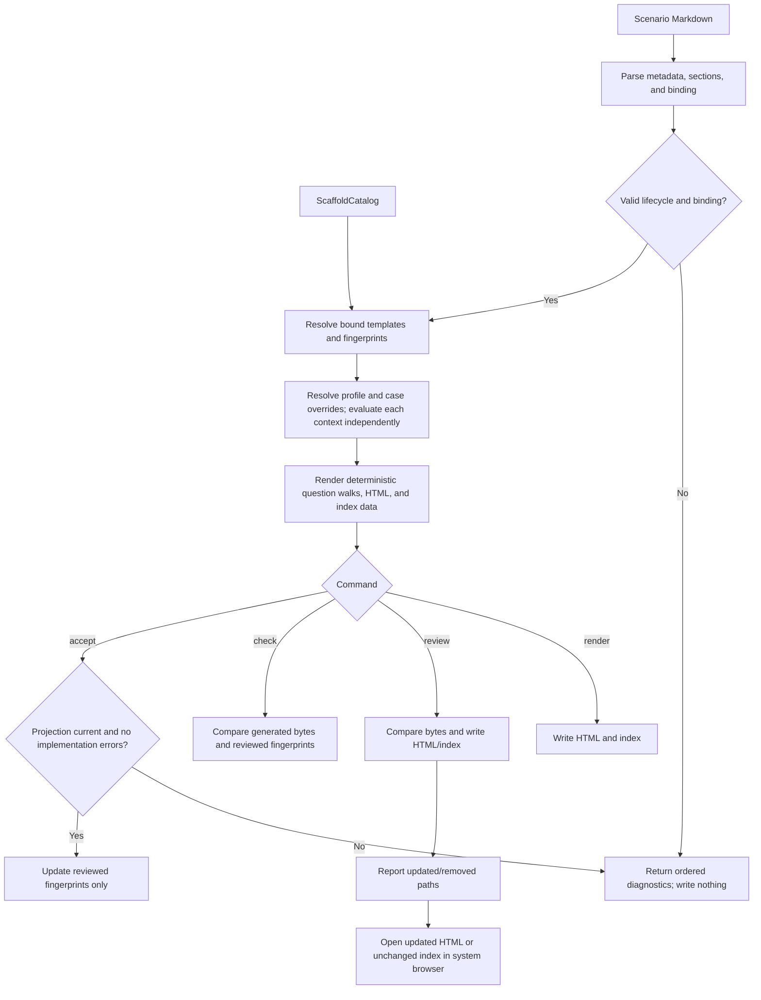

# Manage Scenario Artifacts

## Requirement Input

- **Source request:** define declarative, reviewable scenario and test sources; make scenario
  lifecycle metadata-driven; generate review HTML and index data deterministically.
- **Product contract:**
  [`docs/01-product/scenarios/README.md`](../../../01-product/scenarios/README.md)
- **Implementation metadata:**
  [`inspect-scaffold-catalog.md`](../scaffolding/inspect-scaffold-catalog.md)
- **Product behavior change:** none. This operation manages product-review artifacts and does not
  change a Toolkit user flow.

## Purpose

Manage scenario Markdown as the product source, v4 scaffold declarations as the implementation
source, and checked-in HTML as a deterministic human-review projection. Lifecycle state belongs to
Markdown metadata rather than directory names. The operation also preserves an explicit human
review gate: rendering can expose implementation drift, but only acceptance may update reviewed
fingerprints.

## Inputs

The operation reads a scenario root and, when scenarios contain implementation bindings, the
`create` and `modify` `ScaffoldCatalog` values produced by the scaffold catalog inspector.

Scenario metadata contains:

| Field                    | Requirement                                                               |
| ------------------------ | ------------------------------------------------------------------------- |
| `Status`                 | `draft`, `review`, `approved`, `implemented`, `archived`, or `superseded` |
| `Scenario ID`            | Stable `SCN-*` identity                                                   |
| `Scenario group`         | Stable workload group matching the parent directory                       |
| `Visual/state reference` | Same-basename HTML file                                                   |
| `Proposal key`           | Required only for a sibling proposal                                      |
| `Supersedes`             | Proposal baseline, or canonical successor from a historical contract      |
| `Redesign trigger`       | Required only for a sibling proposal                                      |

All metadata fields and authored sections marked required by the product contract are required
here as well. Values must be non-empty, and `Scenario ID` must use the stable `SCN-*` form. The
only compatibility exception is a missing `Status`, which remains legacy current with a warning.

An optional `## Implementation binding` contains one YAML document:

```yaml
version: 1
scaffolding:
  kind: create
  templateIds:
    - template-id
  reviewContexts:
    - id: vscode-default
      surface: vscode
      environmentProfile: vscode-shipped
      featureFlags: {}
      answers: {}
  reviewedFingerprints:
    semantic: pending
    presentation: pending
```

Review contexts select a surface environment profile, case-specific feature-flag overrides, and
symbolic answers used to expose conditional branches. They do not copy selector predicates,
presentation labels, languages, expanded questions, pipelines, or the complete host environment.
Each context is a closed object containing a non-empty string `id`, a non-empty string `surface`, a
non-empty string `environmentProfile`, a boolean-valued `featureFlags` override object, and an
`answers` object. Answer values are strings, string arrays, or an exact
`{ state: empty | non-empty }` symbolic secret object. A secret or password answer may be absent or
symbolic; a literal secret is invalid.

Question projection resolves feature flags deterministically in this order: shared fx-core registry
defaults, then the named surface profile, then the review context's `featureFlags` overrides. The
rightmost value wins. `vscode-shipped` includes feature-flag values established by the shipped VS
Code host before the create walk; `cli-shipped` uses the shipped CLI host values. Profiles are
versioned source data and never read the scenario command's ambient `process.env`. A profile must
match the context surface. Unknown profiles, unknown overridden or condition-referenced feature
flags, and profile/surface mismatches are errors that prevent artifact writes.

The root binding, `scaffolding`, review-context, symbolic-state, and `reviewedFingerprints` objects
are closed. Template IDs and review-context IDs are non-empty and unique. Review answer keys must
name a selector question, a question from one of the bound templates, or an operation-owned create
floor question (`language`, `folder`, or `app-name`). Each answer must match the question type;
static-option answers must name authored option IDs, arrays are valid only for multi-selects, and
symbolic states are valid only for password questions. Feature-flag names are non-empty. Each
reviewed fingerprint is either `pending` or a lowercase 64-character SHA-256 value.

The renderer reuses the canonical v4 expression evaluator for question and option conditions. It
renders one authored-order, read-only question walk for each declared review context; conditions are
evaluated independently so questions selected for one surface never appear in another surface's
walk. Selector and static-option answers mark the matching VS Code-style option selected, while
non-secret scalar answers populate the matching input. Dynamic option providers are not executed and
are represented as unresolved runtime Quick Picks. Missing answers remain visibly unselected or
empty. Create walks reuse descriptor language gating and the common `folder` / `app-name` composer.
`singleFileOrText` renders its authored picker and nested input state. String arrays remain outside
the evaluator's scalar scope, matching v4 input collection. Exact secret states map to an empty string
or a fixed non-secret non-empty value. A condition that cannot be evaluated from the context scope is
an error and prevents artifact writes.

## Outputs

The operation exposes six commands:

| Command            | Output                                                                                                                                                                                      |
| ------------------ | ------------------------------------------------------------------------------------------------------------------------------------------------------------------------------------------- |
| `scenario:catalog` | Deterministic JSON projection of one scaffold catalog selected by `--kind`.                                                                                                                 |
| `scenario:init`    | New, scanner-valid, non-overwriting canonical or sibling-proposal Markdown skeleton with `Status: draft`; requires an explicit `--timestamp`.                                               |
| `scenario:render`  | Same-basename HTML and index data; removes generated-marker HTML without a Markdown owner.                                                                                                  |
| `scenario:review`  | Render output plus an ordered `updated` / `removed` artifact list; opens updated generated HTML, or the current index when no bytes changed, in the system browser for local visual review. |
| `scenario:check`   | Ordered errors and warnings, including stale or orphaned generated HTML; no file writes.                                                                                                    |
| `scenario:accept`  | Updated semantic and presentation fingerprints in one Markdown binding.                                                                                                                     |

`scenario:review` compares expected and current bytes before writing, so its
change list does not depend on Git state and also detects untracked output and
catalog changes that affect multiple bound scenarios. It opens every updated
scenario HTML page. When no scenario page changed but the generated index did,
it opens the index. When no generated bytes changed, it opens the current index
so every successful review command has a stable visual review surface. Removed
orphan pages are reported but cannot be opened. A validation error writes and
opens nothing. A browser-launch failure occurs after deterministic artifacts
are written, reports their review paths, and returns a failing exit code without
rolling back the generated files.

Scenario index groups are metadata-driven:

- `approved` and `implemented` appear under **Current**;
- `draft` and `review` appear under **In review**;
- `archived` and `superseded` are hidden.

During migration, a scenario without `Status` is treated as legacy current and emits a warning.
A legacy file under `draft/` is classified from its explicit `Status` and emits a location warning;
its location does not determine lifecycle state.

## Fingerprints

Each bound template produces two SHA-256 fingerprints over normalized structured values:

- **semantic:** template descriptor semantics, all selector routes targeting the template, question
  and option identity/type/order/conditions, nested input-box runtime configuration, languages,
  provider ids, and pipeline semantics;
- **presentation:** English selector and expanded-question titles, option labels, descriptions,
  details, nested input-box presentation, localization key provenance, and rendered icon paths in
  authored order.

Normalization recursively sorts object keys while preserving array order. It excludes `$schema`,
spec paths, JSON formatting, timestamps, and template content bytes.

`scenario:render` always displays current fingerprints but never changes reviewed fingerprints.
`scenario:accept` is the only command that writes reviewed fingerprints, and it never changes
`Status`. Acceptance publishes through a no-clobber temporary-file protocol; a source change before
publication leaves the latest Markdown in place and reports `ScenarioSourceChanged`.

Fingerprint drift diagnostics identify the changed channel independently and include the reviewed
and current fingerprint values. A semantic change and a presentation change therefore remain
separately actionable even when both occur in one scenario.

Generated presentation controls preserve authored localization keys alongside the resolved English
review text. The renderer does not load locale bundles or make localized text a behavior source.

## Coverage Policy

Every scaffold template and every external route is either owned by a scenario binding or reported
as an ordered migration warning. An external route is covered when a bound template owns a selector
route with the same predicate. Unbound coverage remains non-blocking during migration; malformed or
ambiguous bindings remain errors.

An unbound scenario is projected from Markdown alone and does not require either scaffold catalog.
A bound scenario requires only the catalog matching its declared `kind`. The repository-wide
`scenario:check` command additionally inspects both catalogs so it can report all uncovered
templates and external routes; `render` and `accept` load only kinds used by bindings.

## Acceptance Criteria

| ID     | Runtime | Purpose               | Gate   | Harness                                     | Given / When / Then                                                                                                                                                                                                                                                                                                                                                                                                                                                                                                                                                |
| ------ | ------- | --------------------- | ------ | ------------------------------------------- | ------------------------------------------------------------------------------------------------------------------------------------------------------------------------------------------------------------------------------------------------------------------------------------------------------------------------------------------------------------------------------------------------------------------------------------------------------------------------------------------------------------------------------------------------------------------ |
| MSA-01 | L1      | operation-integration | per-PR | temporary scenario tree                     | Given canonical scenarios with every lifecycle status, when cataloging, then classification follows metadata, hidden states are omitted, and paths are ordered deterministically.                                                                                                                                                                                                                                                                                                                                                                                  |
| MSA-02 | L1      | operation-integration | per-PR | temporary scenario tree                     | Given duplicate active scenario identities, duplicate current template owners, a proposal without a valid baseline or redesign trigger, or a historical contract without a matching canonical successor, when checking, then the operation reports deterministic errors without writing files.                                                                                                                                                                                                                                                                     |
| MSA-03 | L1      | compatibility         | per-PR | temporary scenario tree                     | Given a legacy status-less scenario or a `draft/`-located scenario with explicit metadata, when checking, then metadata classification is preserved and a migration warning is emitted.                                                                                                                                                                                                                                                                                                                                                                            |
| MSA-04 | L1      | operation-integration | per-PR | in-memory scaffold catalog                  | Given semantically equal catalog values with different object-key order, when fingerprinting, then both fingerprints are equal; changing semantic or English presentation data changes only the applicable fingerprint.                                                                                                                                                                                                                                                                                                                                            |
| MSA-05 | L1      | operation-integration | per-PR | temporary scenario tree + in-memory catalog | Given valid Markdown with create and modify bindings, when rendering twice in one invocation, then byte-identical generated HTML and index data are produced without modifying Markdown or reviewed fingerprints.                                                                                                                                                                                                                                                                                                                                                  |
| MSA-06 | L1      | operation-integration | per-PR | temporary scenario tree + in-memory catalog | Given generated HTML that is missing, changed, or has no Markdown owner, when checking, then stale/orphaned projection is an error; render removes only marker-owned orphans; draft/review fingerprint drift is a warning and approved/implemented drift is an error.                                                                                                                                                                                                                                                                                              |
| MSA-07 | L1      | security              | per-PR | in-memory binding                           | Given a literal value for a secret review answer, when parsing or rendering, then the operation rejects it and the value never reaches HTML or diagnostics.                                                                                                                                                                                                                                                                                                                                                                                                        |
| MSA-08 | L1      | operation-integration | per-PR | temporary scenario tree                     | Given a valid canonical init request with an explicit timestamp, when initializing, then identical inputs produce identical draft Markdown; an existing slug or identity is never overwritten, and only explicit `--proposal` against a canonical Current contract creates a sibling proposal.                                                                                                                                                                                                                                                                     |
| MSA-09 | L1      | operation-integration | per-PR | temporary scenario tree + in-memory catalog | Given a valid bound scenario whose generated projection is current, when accepting, then only the two reviewed fingerprints change; invalid bindings, stale projection, unresolved implementation errors, or a source change during acceptance leave the latest Markdown unchanged.                                                                                                                                                                                                                                                                                |
| MSA-10 | L1      | file-unit             | per-PR | generated index fixture                     | Given a scenario catalog, when generating index data, then hand-maintained artifact arrays are replaced by one generated data block containing Current and In-review paths only.                                                                                                                                                                                                                                                                                                                                                                                   |
| MSA-11 | L1      | operation-integration | per-PR | temporary scenario tree + in-memory binding | Given missing or empty required metadata, a missing required authored section, an invalid Scenario ID, an incomplete binding, an unknown field in any closed binding object, duplicate or empty stable identifiers, an invalid reviewed fingerprint, or an invalid review answer, when parsing, then the contract is rejected without copying authored values into diagnostics.                                                                                                                                                                                    |
| MSA-12 | L1      | operation-integration | per-PR | temporary scenario tree                     | Given an unbound scenario and no scaffold catalogs, when rendering or checking, then its Markdown-only projection succeeds; given a bound scenario, only the catalog matching the declared kind is required.                                                                                                                                                                                                                                                                                                                                                       |
| MSA-13 | L1      | operation-integration | per-PR | temporary scenario tree + in-memory catalog | Given reviewed fingerprints that differ from current values, when checking, then semantic and presentation drift are reported independently with reviewed and current fingerprints, using lifecycle-based severity.                                                                                                                                                                                                                                                                                                                                                |
| MSA-14 | L1      | file-unit             | per-PR | in-memory scaffold catalog                  | Given authored localization keys on selector and template presentation, when rendering, then generated controls preserve those keys alongside escaped English review text without loading locale bundles.                                                                                                                                                                                                                                                                                                                                                          |
| MSA-15 | L1      | operation-integration | per-PR | in-memory scaffold catalogs                 | Given unbound scaffold templates or external routes, when checking, then each uncovered declaration produces one deterministic migration warning; a matching bound template route covers the external route.                                                                                                                                                                                                                                                                                                                                                       |
| MSA-16 | L1      | operation-integration | per-PR | repository scenario root                    | Given repository scenarios and v4 declarations, when the per-PR scenario check runs, then any error fails the job while migration warnings remain visible and non-blocking.                                                                                                                                                                                                                                                                                                                                                                                        |
| MSA-17 | L1      | operation-integration | per-PR | temporary scenario tree + injected launcher | Given missing, stale, unchanged, and orphaned generated artifacts, when reviewing, then the command reports an ordered pre-write `updated` / `removed` change set, opens only updated scenario HTML (or the index when it changed alone), opens the current index when no generated bytes changed, opens nothing on validation failure, and reports a launcher failure without discarding generated files.                                                                                                                                                         |
| MSA-18 | L1      | operation-integration | per-PR | temporary scenario tree + in-memory catalog | Given multiple review contexts with surface-specific conditions and answers, when rendering, then each context produces an independent authored-order VS Code-style question walk, create walks include descriptor language and the common floor, `singleFileOrText` preserves its picker and nested input, answered controls show their state, dynamic providers remain unresolved, secrets are never rendered, and questions visible only in another context are absent from that walk.                                                                          |
| MSA-19 | L1      | operation-integration | per-PR | temporary scenario tree + in-memory catalog | Given a review context with a named surface environment profile and case-specific feature-flag overrides, when rendering, then registry defaults are overlaid by deterministic host-profile values and then case overrides; `vscode-shipped` exposes the shipped Ask Copilot selector option unless the case explicitly disables its flag; CLI surface conditions remain excluded; ambient process variables do not affect output; and an unknown profile, unknown overridden or referenced flag, or profile/surface mismatch reports an error and writes nothing. |

## Flow



## Boundary

- This operation does not infer a user goal, success state, scenario narrative, or test intent.
- It does not promote lifecycle status or decide that human review is complete.
- It does not produce an image or DOM-level visual diff; the browser projection
  and ordered byte-change list are the review inputs.
- It does not execute templates, providers, pipelines, VscUse groups, or product commands.
- It does not read ambient process environment variables or generated-project `.env*` files when
  resolving review contexts.
- It does not implement a browser-side wizard or re-evaluate conditions in generated HTML.
- It does not invert selector expressions or choose one concrete test path.
- It does not persist, expand, log, or render secrets.
- It does not make HTML or generated index data a behavior source.

## Invariants

- Markdown authored content is never overwritten by render or check.
- HTML and index data are fully regenerable and carry a generated-file marker.
- A successful render removes orphaned marker-owned HTML and never removes manual HTML.
- Status metadata, not a directory name, determines lifecycle state.
- A `Scenario ID` has at most one current canonical contract.
- A sibling proposal uses the same `Scenario ID`, has a unique `Proposal key`, and names its
  canonical baseline through `Supersedes`, with a non-empty `Redesign trigger`.
- An archived or superseded contract names its canonical current successor through `Supersedes`.
- One current scenario owns a bound template at most once.
- Rendering cannot acknowledge implementation drift.
- Review uses the same deterministic projection as render; browser launching
  cannot alter generated bytes or reviewed fingerprints.
- A browser-launch failure never rolls back successfully generated artifacts.
- Unbound scenario projection has no scaffold-catalog dependency.
- Localization keys are provenance; resolved English text remains the review projection.
- Any validation failure produces no partial writes.
- Diagnostics and generated artifacts are deterministic for equal inputs.
- Environment resolution is registry defaults, then the named surface profile, then case overrides;
  all inputs are deterministic source data.
