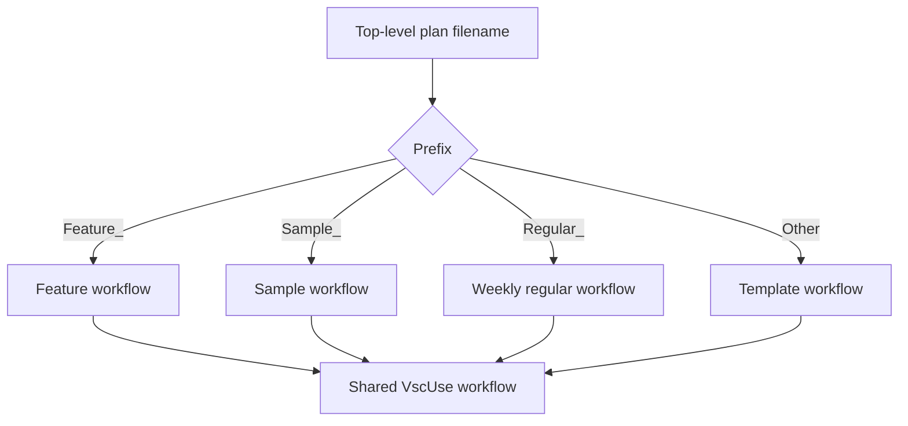

# Operation — `run-vscuse-test-plans`

## Purpose

Route top-level VscUse plans to independent GitHub Actions workflows by filename
prefix so release-focused plans can run daily while regular regression plans run
weekly.

Requirement source:
[OfficeDev/microsoft-365-agents-toolkit-test#26359](https://github.com/OfficeDev/microsoft-365-agents-toolkit-test/issues/26359).

## Acceptance Criteria

| ID     | Criterion                                                                                     | Runtime | Purpose  | Gate     | Harness       |
| ------ | --------------------------------------------------------------------------------------------- | ------- | -------- | -------- | ------------- |
| VTR-01 | Template runs select plans that do not start with `Feature_`, `Sample_`, or `Regular_`.       | L1      | scenario | required | workflow YAML |
| VTR-02 | Regular runs can be dispatched manually and are scheduled once per week.                      | L1      | scenario | required | workflow YAML |
| VTR-03 | Regular runs select only top-level `Regular_*.json` plans through the shared VscUse workflow. | L1      | scenario | required | workflow YAML |

## Flow

## Boundary

- This operation does not change plan contents, plan IDs, step IDs, or execution
  behavior.
- This operation does not add the regular workflow to the daily
  template-to-feature-to-sample chain.
- This operation does not classify generated plans owned by
  `.vscuse-generated-plans`.

## Invariants

- Every top-level plan belongs to exactly one default workflow selector.
- Explicit `test_plan` workflow input continues to override default discovery.
- Scheduled regular runs use the shared retry, reporting, and notification
  behavior.
