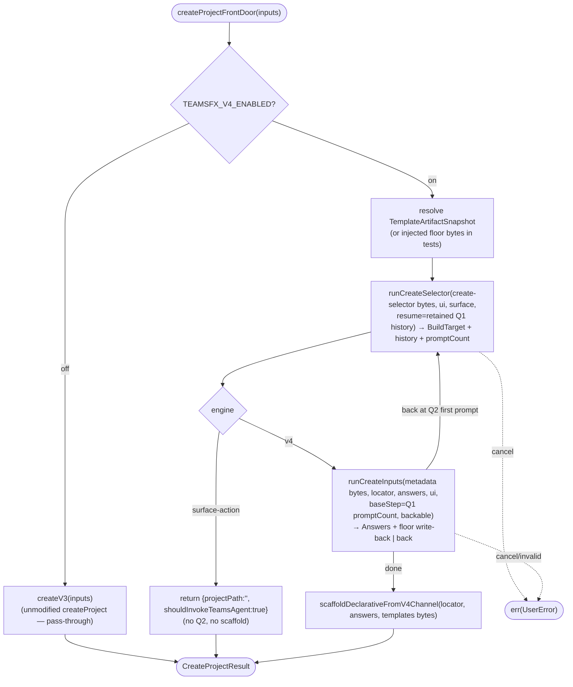

# Operation — `dispatch-create-by-engine`

- **Status:** Accepted (design-first) — ready for tests (Gate 1 placement + Gate 2 AC approved 2026-06-12)
- **Domain:** [`01-scaffolding`](../../domains/01-scaffolding.md)
- **Decision source:** [ADR-0014](../../../02-architecture/adr/ADR-0014-dispatcher-buildtarget-resolution.md)
  (the `BuildTarget` dispatch: one resolved target, routed by `engine`) and the
  [create proposal](../../../02-architecture/scaffolding.create.proposal.md)
  (front-loaded funnel, principle 1)
- **Upstream operations:**
  [`walk-create-selector`](walk-create-selector.md) (the Q1 front door — produces
  the `BuildTarget`), [`collect-create-inputs`](collect-create-inputs.md) (the v4
  Q2 + common create floor), [`resolve-build-target`](resolve-build-target.md)
  (the engine/templateId contract the walk wires)
- **Supersedes:** the deleted `route-declarative-via-selector` /
  `resolveMcpDaRouting` shim — the post-Q1 batch shim is replaced by a generic
  selector Q1 that produces `engine`/`templateId` for **every** create kind, not
  just the DA+MCP case
- **PRD/scenario:** [`scenarios/da/create-mcp-server`](../../scenarios/da/create-mcp-server.md)

## Purpose

Wire the front-loaded create funnel into the **live** `FxCore.createProject` and
route the flow by the resolved `engine`. Behind `TEAMSFX_V4_ENABLED`, the create
flow's **Q1 is the selector walk** ([`walk-create-selector`](walk-create-selector.md)),
not the v3 question tree (principle 1); the resulting `BuildTarget`
(`{ templateId, engine, answers }`) is then dispatched:

- **`engine: "v4"`** → run the template's create-input walk via
  [`collect-create-inputs`](collect-create-inputs.md), which asks the
  template-local Q2 plus the common create floor (`folder` + `app-name` +
  descriptor-bound `language`) in one shared question-walk pass, then scaffold
  via `scaffoldDeclarativeFromV4Channel`. The v3 question tree is **not**
  consulted for routing or floor collection.
- **`engine: "surface-action"`** → no Q2, no scaffold; the surface performs the
  action (e.g. `open-github-copilot-chat` → `shouldInvokeTeamsAgent`). This
  generalizes today's hand-coded `ProjectType === startWithGithubCopilot`
  early-return into a selector-driven route.

`{ v4, surface-action }` is the whole closed set: after ADR-0014 Amendments 3
and 5 there is no selector engine that hands off to v3, so the flag-off
pass-through is the only legacy create path.

The front door is a **new entry** (`createProjectFrontDoor`) that the surfaces
call. When `TEAMSFX_V4_ENABLED` is **off**, the front door is a **pure
pass-through** — it delegates straight to `createProject` without consulting the
selector — so the flag-off path is literally the unchanged v3 call (zero
regression). When the flag is on, no branch re-enters the v3 scaffolding flow.

## Boundary

The operation owns the **createProject-level composition** and nothing else:

1. **The Q1 front door** — call `runCreateSelector` over the host
   `UserInteraction` to obtain the `BuildTarget` (it owns the selector read,
   routing-question render, and option filtering; this operation does not).
2. **The engine dispatch** — branch on `BuildTarget.engine`: for `v4` run
  `runCreateInputs` (Q2 + common floor), then
  `scaffoldDeclarativeFromV4Channel`; for `surface-action` perform the action
  and return.

It does **not** ask the selector's routing questions itself (that is
`runCreateSelector`), does **not** ask the v4 Q2 or common floor (that is
`runCreateInputs`), does **not** render or scaffold (that is
`scaffoldDeclarativeFromV4Channel`), and does **not** modify `createProject` or
its middleware chain.
It calls the distribution seam to resolve one staged `TemplateArtifactSnapshot`
for the invocation, then passes the relevant artifact bytes to Q1, Q2, and
scaffold: `create-selector.json` for Q1, `templates-metadata.zip` for Q2, and
`templates.zip` for rendering. Tests may inject raw floor bytes instead, but the
production path does not split selector and content resolution.

## Inputs

| Input | Type | Origin |
|-------|------|--------|
| `inputs` | `Inputs` (`@microsoft/teamsfx-api`) | the host inputs bag; pre-filled CLI args / URL seeds are read as `entryParams`, and the routing decision + collected answers are merged back so the generator dispatches on them |
| `ui` | `UserInteraction` (`@microsoft/teamsfx-api`) | the host surface; the only non-v4 type the funnel halves touch (INV-7 preserved) |
| `surface` | `SurfaceId` (`"vscode"` \| `"cli"` \| …) | scopes option filtering (e.g. `start-with-github-copilot` only on `vscode`) — passed straight through to `runCreateSelector` |
| `deps` | `{ flagReader?, optionsProvider?, resolveArtifactSnapshot?, artifactSnapshot?, readFloorBytes?, runSelector?, resolveByTemplateId?, runInputs?, scaffoldDeclarative?, createV3? }` (injected, defaulted) | feature-flag reader (default env-backed), optional staged-artifact resolver/snapshot (production), optional bundled-floor reader (tests/fallback), optional create-input provider registry override passed through to `runInputs`, the two funnel halves (`runSelector` for the Q1 walk + `resolveByTemplateId` for the preset-`template-name` short-circuit, and `runInputs` for Q2 + common floor), the declarative scaffold, and the flag-off legacy handler (`createV3` defaults to `FxCore.createProject` bound) — all defaulted to the real implementations and stubbable for isolation in tests |

## Outputs

`Promise<Result<CreateProjectResult, FxError>>` — the front door is a drop-in for
`createProject` at the surface, so it returns the same shape:

- `ok(CreateProjectResult)` — `engine:"v4"` returns the declarative scaffold's
  result; `engine:"surface-action"` returns `{ projectPath: "", shouldInvokeTeamsAgent: true }`
  (e.g. `open-github-copilot-chat`) without scaffolding.
- `UserError` — a surface cancellation during Q1/Q2 (propagated unchanged), or a
  user-fixable Q2 input failure surfaced by `runCreateInputs`.
- `SystemError` — an engine-side break (a missing `selector.json` /
  `questions.json` / `descriptor.json` in the floor, an unknown `templateId`).

## Acceptance Criteria

| ID | Tier | Given | When | Then |
|----|------|-------|------|------|
| DCE-01 | L1 | `TEAMSFX_V4_ENABLED` **off**, any create inputs | `createProjectFrontDoor` | delegates straight to `createV3` (the unmodified `createProject`) — pure pass-through; `runCreateSelector` is never called and the result equals the pre-flag v3 call (zero regression) |
| DCE-02 | L1 | flag **on**, `TEAMSFX_MCP_FOR_DA_DT` **on**, in-memory floor, a scripted UI answering Q1 `projectType=copilot-agent-type → daTemplate=add-action → actionSource=mcp` and the create-input walk | `createProjectFrontDoor` | resolves `engine:"v4"` / `templateId:"da/mcp-server"`; runs Q2 + common floor via `runCreateInputs` then `scaffoldDeclarativeFromV4Channel`; `createV3` is **not** called; returns `ok(CreateProjectResult)` |
| DCE-03 | L1 | flag **on**, the same DA+MCP Q1 answers, a scripted create-input walk answering `url` + `authType=none` + floor | `createProjectFrontDoor` | the `answers` handed to `scaffoldDeclarativeFromV4Channel` carry `mcpServerType="remote"` / `mcpServerUrl=<url>` / `authType="none"` plus the common floor values (the `runCreateInputs` contract) under the `{ kind:"create", templateId:"da/mcp-server" }` locator |
| DCE-04 | L1 | flag **on**, a selector or preset resolves `engine:"v3"` | `createProjectFrontDoor` | **withdrawn** — `engine:"v3"` is no longer a valid BuildTarget after the v4 migration; malformed selectors are rejected before front-door dispatch |
| DCE-05 | L1 | flag **on**, `TEAMSFX_MCP_FOR_DA_DT` **off**, the DA+MCP Q1 answers | `createProjectFrontDoor` | resolves `engine:"v4"` / `templateId:"da/mcp-server-static"`; runs Q2 + v4 scaffold, whose `generate-template` telemetry reports the v3-compatible `declarative-agent-with-action-from-mcp` key (DCE-19) |
| DCE-06 | L1 | flag **on**, `surface="vscode"`, a scripted UI answering `projectType=start-with-github-copilot` | `createProjectFrontDoor` | resolves `engine:"surface-action"` / `templateId:"open-github-copilot-chat"` (no `language`, no Q2); returns `ok({ projectPath:"", shouldInvokeTeamsAgent:true })` without calling `createV3` or scaffolding (the hand-coded `ProjectType` early-return is now selector-driven) |
| DCE-07 | L1 | flag **on**, the DA+MCP route (DT on) | front-door dispatch | the `templateId` originates from the selector walk (principle 1); the legacy `resolveMcpDaRouting` post-Q1 batch shim is **not** invoked — locking in that the front door supersedes it |
| DCE-08 | L1 | flag **on**, a scripted UI that cancels during Q1 | front-door dispatch | `err` is a `UserError` (cancellation) propagated unchanged; **no** Q2 runs and **no** scaffold occurs |
| DCE-09 | L3 | flag **on**, the VS Code create command, the DA+MCP path | run the create command end to end | the selector quick-picks render Q1, the v4 create-input prompts follow (template questions + common floor), and the project scaffolds via the declarative channel — documented manual/E2E walkthrough |
| DCE-10 | L1 | flag **on**, `inputs["template-name"] = "default-bot"` preset, and the preset resolves to `engine:"v3"` | `createProjectFrontDoor` | **withdrawn** — preset resolution no longer produces `engine:"v3"`; unknown or unroutable presets return an explicit route-not-found error (DCE-12) |
| DCE-11 | L1 | flag **on**, `inputs["template-name"] = "da/mcp-server"` preset, a selector whose route is `engine:"v4"` | `createProjectFrontDoor` | resolves via `resolveByTemplateId` (no Q1 walk) to `engine:"v4"`; runs Q2 via `runCreateInputs` then `scaffoldDeclarativeFromV4Channel`; `runSelector` is **not** called |
| DCE-12 | L1 | flag **on**, `inputs["template-name"]` preset to an id with **no** selector route | `createProjectFrontDoor` | `resolveByTemplateId` returns an explicit route-not-found error; no v3 default is synthesized and `createV3` is **not** called |
| DCE-13 | L1 | flag **on**, `inputs.nonInteractive = true`, **no** preset `template-name` | `createProjectFrontDoor` | walks Q1 via `runSelector` with `interactive:false`, so an un-pre-filled gated dimension is a `BuildTargetMissingDimension` `UserError` (a non-interactive surface never silently prompts) rather than a hang |
| DCE-14 | L1 | flag **on**, the DA+MCP v4 route, a scripted UI answering template questions and the common floor | `createProjectFrontDoor` | `runCreateInputs` collects `folder` + `app-name` in the same walk as Q2, writes them to the same `inputs` bag the scaffold then reads, and no separate front-door `collectCreateFloor` prompt engine runs |
| DCE-15 | L1 | flag **on**, the v4 route, a scripted UI that cancels a common-floor prompt inside `runCreateInputs` | `createProjectFrontDoor` | `err` is the cancellation `UserError` propagated unchanged; **no** scaffold occurs |
| DCE-19 | L1 | flag **on**, a v4 target whose id has a known v3 template equivalent | `scaffoldV4` builds its telemetry properties | it derives the v3-compatible template id from `target.templateId` alone, so `generate-template` telemetry keeps joining with command-level `create-project`. The front door writes **no** `inputs["template-name"]`: the legacy id is a telemetry key, not a dispatch input, so it cannot reach a v3 generator or short-circuit the create-input walk |
| DCE-20 | L1 | flag **on**, a v4 target whose id has no mapping entry | `scaffoldV4` builds its telemetry properties | the telemetry template id falls back to the v4 target id itself, preserving a stable match key for `generate-template` |
| DCE-21 | L1 | flag **on**, the v4 scaffold succeeds or fails after target resolution | `scaffoldV4` | emits `generate-template` success/error telemetry with `template-name = <mapped-or-fallback-template-id>-<language-key>` and the resolved v4 package source/version/digest properties, so existing OKR queries can continue to join `generate-template` with `create-project` by correlation id |
| DCE-22 | L1 | flag **on**, the DA+MCP v4 route, a scripted UI answering Q1, reaching Q2, then returning `back` at Q2's **first** prompt | `createProjectFrontDoor` | the front door does **not** cancel the create; it re-enters Q1 (resuming at its last dimension — walk-create-selector WCS-24, collect-create-inputs CCI-25) so the user can re-pick a Q1 dimension — Q1 and Q2 form one continuous back-navigable wizard across the phase boundary |
| DCE-23 | L1 | flag **on**, after re-entering Q1 the user picks a **different** dimension that resolves a **different** `templateId` (e.g. `daTemplate` `add-action`→`no-action`) | `createProjectFrontDoor` | the loop resolves the new `BuildTarget` and runs `runCreateInputs` fresh under the new `locator`, loading that template's Q2+Q3 (CCI-26); the prior template's Q2 answers are discarded and no stale question is asked — the Q2+Q3 set always matches the currently resolved template |
| DCE-24 | L1 | flag **on**, the user backs through Q2 into Q1 and then `back` at Q1's **first** dimension | `createProjectFrontDoor` | the whole create is cancelled with the propagated `BuildTargetWalkCancelled` `UserError` (the true top of the wizard); no scaffold occurs |
| DCE-25 | L1 | flag **on**, a re-entry loop iteration | `createProjectFrontDoor` | the loop re-walks Q1; no iteration can create a preset short-circuit, because the front door never writes `inputs["template-name"]` (DCE-19) and the preset fast path (INV-8) is evaluated once, before the loop |
| DCE-26 | L1 | flag **on**, an app name that renders a manifest short name longer than 25 characters | `scaffoldV4` completes | the scaffolded `appPackage/manifest.json` short name is trimmed to the 25-character store limit with its `${{...}}` placeholders preserved — the same create tail the legacy `coordinator.create` runs |

## Flow

## Invariants

- **INV-1** — Flag-off is pure v3. With `TEAMSFX_V4_ENABLED` off the front door
  delegates straight to `createV3` (the unmodified `createProject`) — a pure
  pass-through, so the v3 `QuestionMW` and generator run exactly as before and no
  v4 code is reached (DCE-01).
- **INV-2** — The create Q1 is the selector, not the v3 tree. When the front door
  runs, the `templateId` and `engine` come from `runCreateSelector`
  (principle 1); the v3 question tree never decides routing
  (walk-create-selector INV-2).
- **INV-3** — One target, dispatched by `engine`. Exactly one `BuildTarget` is
  resolved and routed by its `engine` to a single execution path
  ([ADR-0014](../../../02-architecture/adr/ADR-0014-dispatcher-buildtarget-resolution.md));
  the DT-on / DT-off twins differ only by which v4 template id the selector
  returns (DCE-02 / DCE-05), not by a capability-specific branch in this
  operation.
- **INV-3a** — No hidden business logic in the front door. This operation may
  resolve sources, run Q1/Q2+floor, dispatch by `engine`, and pass registries or
  dependencies through. It MUST NOT branch on a template id, capability,
  provider id, auth type, or file path to perform business behavior. Such
  behavior belongs in selector/template data, providers/validators, or pipeline
  steps.
- **INV-4** — The v4 funnel halves stay v3-free. This orchestrator is a **seam**
  (it touches the v3 `Inputs` bag and calls `createV3`), so it lives outside
  `src/v4` (alongside the bridge / core wiring). It calls `runCreateSelector` /
  `runCreateInputs` only through their exported pure contracts; it adds **no** v3
  import into `src/v4`, so INV-7 holds (walk-create-selector INV-1).
- **INV-5** — No flag-on v3 hand-off. With `TEAMSFX_V4_ENABLED` on, the closed
  selector engine set is `{ v4, surface-action }`, so no resolved `BuildTarget`
  can name a v3 target at all (ADR-0014 Amendments 3 and 5). Legacy
  scaffolding is reachable only through the flag-off pass-through (DCE-01).
- **INV-6** — The source read is injectable, so the whole funnel + dispatch is
  CI-testable from an in-memory floor built from the loose `templates/v4` source,
  with the two funnel halves stubbable via `deps` — no built artifact, no
  network.
- **INV-7** — One resolved source per invocation. In production, this operation
  resolves one staged `TemplateArtifactSnapshot` and reads selector, metadata,
  and full-template bytes from that snapshot; tests may inject floor bytes, but
  the operation does not introduce a parallel routing path. It also **deletes**
  the `resolveMcpDaRouting` shim (DCE-07).
- **INV-8** — A preset `template-name` short-circuits Q1; non-interactive never
  silently prompts. When the surface already resolved the leaf template (the CLI
  non-interactive presets `template-name` from `-c`), the front door resolves the
  `BuildTarget` by `templateId` (`resolveByTemplateId`) instead of walking Q1;
  an unresolved preset is an explicit error, never a legacy v3 fallback
  (DCE-11/-12). On the non-preset path the host
  `nonInteractive` is threaded into the Q1 walk as `interactive:false`, so a
  scripted surface that under-specifies its dimensions fails fast with a
  `BuildTargetMissingDimension` `UserError` rather than hanging on a prompt
  (DCE-13). Both behaviors live behind `TEAMSFX_V4_ENABLED` (default off); turning
  the flag on is the v4 opt-in path.
- **INV-9** — The v4 path collects its common create floor inside
  `runCreateInputs`. Because the front door carries no `QuestionMW`, the
  `engine:"v4"` branch delegates `folder` + `app-name` to the Q2 + floor create
  input walk, then scaffolds (DCE-14). There is no second front-door
  `collectCreateFloor` prompt engine and no v3 question-tree visitor. Preset
  `folder` / `app-name` values are reused and never re-prompted; a floor
  cancellation propagates unchanged with no scaffold (DCE-15).
- **INV-10** — Cross-phase back is a front-door re-entry loop; Q1 history
  retained, Q2+Q3 stateless-rebuilt. With `TEAMSFX_V4_ENABLED` on, the
  `engine:"v4"` path is a loop: run Q1 (retaining its `history` + `promptCount`),
  dispatch, run Q2+floor with `baseStep = promptCount` and `backable`, and on a
  Q2-first `back` re-enter Q1 via its retained history (DCE-22..24). Q2+Q3 are
  rebuilt fresh from the resolved `BuildTarget` on every forward crossing
  (collect-create-inputs CCI-26 / INV-11) — the loop keeps **no** Q2 answer
  cache, so a changed `templateId` yields the new template's questions with no
  invalidation logic. The loop is scoped **below** the preset-`template-name`
  check, and the front door never writes `inputs["template-name"]` itself, so no
  iteration can short-circuit Q1 (DCE-25). All back logic lives in the shared engine (collect-inputs INV-9); the
  front door only ferries the opaque `history` between phases. The whole loop is
  behind the flag (default off); flag-off is the unchanged v3 pass-through
  (INV-1).

## Notes

- **Decided (Gate 1, 2026-06-12) — front-door placement.** A **new entry**
  `createProjectFrontDoor(inputs)` that the surfaces call. Flag-off ⇒ it delegates
  straight to the unmodified `createProject` (pure pass-through). Flag-on ⇒ it runs
  `runCreateSelector` (Q1) and dispatches: `v4` → `runCreateInputs` +
  `scaffoldDeclarativeFromV4Channel`; `surface-action` → the action.
  **Rationale:** v4 has formally migrated;
  once the v4 front door is enabled, it must not re-enter legacy scaffolding.
  The legacy create path is still available through the flag-off opt-out, so no
  v3 branch is woven into the v4-enabled dispatch.
- **Increment scope.** Current `engine:"v4"` create routes include the native
  Declarative Agent no-action, MCP-server, new-API, API-key, OAuth/Entra, and
  existing-OpenAPI packages. Additional create capabilities must land as authored
  v4 packages before being routed through this front door; they do not ride an
  `engine:"v3"` coexistence branch.
- **What this deletes.** Landing this supersedes the deleted
  `route-declarative-via-selector` / `resolveMcpDaRouting` shim: the DA+MCP case
  now flows through the generic selector Q1 → `engine:"v4"` → declarative
  scaffold, so the post-Q1 batch shim is removed rather than extended.
- **Amendment (2026-06-15, superseded by Q2+floor design) — the v4 path owns its
  create floor (INV-9).** The front door carries no `QuestionMW`, so the first v4
  route to reach `scaffoldV4` in an interactive surface failed with
  `MissingRequiredInputError: folder`. The migration seam first solved that by
  adding a separate `collectCreateFloor` composition-root prompt. The target v4
  design folds those common floor questions into `runCreateInputs`: template Q2,
  descriptor-bound `language`, and `folder` / `app-name` are one shared
  question-walk pass, while the front door remains a dispatch-only seam.
- **Resolved (cross-phase back, 2026-07-08) — a surface auto-skip is
 back-transparent.** The re-entry loop (INV-10) crosses back into Q1 when a
  `back` reaches Q2's walk with an **empty** history. A provider-backed question
  with `skipSingleOption` (e.g. `mcpServerType` when only `remote` is available)
  is auto-selected by the **surface** (`{ type: "skip" }`); the prompt bridge now
  projects that to `{ kind: "skip" }`, and the shared walk records the answer but
  pushes **no** history (collect-inputs INPUT-24 / collect-create-inputs
  CCI-27..28) — identically to a `staticOptions` single-option skip. So when such
  a question is Q2's first, a `back` at the next visible prompt (`mcpServerUrl`)
  now re-enters Q1 rather than re-asking the skipped provider question. (Earlier
  this pushed history and shadowed the Q1 re-entry; it also affected Q2's own
  internal back. Both are fixed by the symmetric skip handling.)

