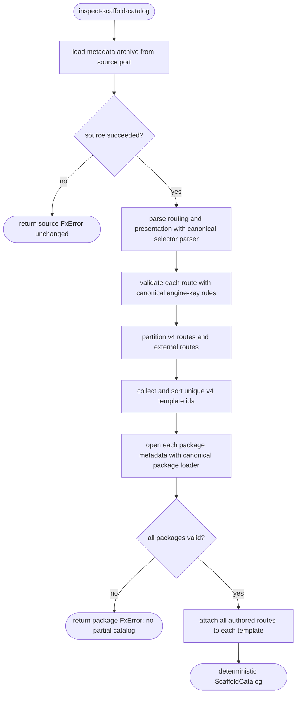

# Operation — `inspect-scaffold-catalog`

- **Status:** Accepted (Gate 1 + Gate 2 cleared 2026-07-14) — ready for tests
- **Domain:** [`01-scaffolding`](../../domains/01-scaffolding.md)
- **Decision source:** [`scaffolding.create.proposal.md`](../../../02-architecture/scaffolding.create.proposal.md)
- **Composed operations:** [`resolve-build-target`](resolve-build-target.md),
  [`open-template-package`](open-template-package.md), and
  [`collect-create-inputs`](collect-create-inputs.md)
- **PRD/scenario:** none required — this is an internal, read-only projection of accepted
  scaffolding declarations for development tooling.

## Purpose

Inspect one v4 metadata source and return a deterministic catalog of the declared create or
modify flow. The catalog lets product-scenario tooling and test compilers consume the same
selector, descriptor, expanded questions, and pipeline declarations as the scaffolding engine
without implementing another metadata parser or question-fragment resolver.

The operation is a projection, not an executor. A selector route is represented symbolically by
its authored `when`, `engine`, and optional surface constraints. Consumers that need one concrete
answer set, such as a future VscUse compiler, resolve that set through the existing expression and
input semantics rather than asking this operation to invert arbitrary expressions.

## Inputs

| Input    | Type                     | Meaning                                                         |
| -------- | ------------------------ | --------------------------------------------------------------- |
| `source` | `ScaffoldMetadataSource` | Port that returns one channel-shaped metadata archive as bytes. |
| `kind`   | `"create" \| "modify"`   | Selector and package family to inspect.                         |

Two adapters implement the source port:

| Adapter            | Input                                 | Behavior                                                                                                                                        |
| ------------------ | ------------------------------------- | ----------------------------------------------------------------------------------------------------------------------------------------------- |
| Authored directory | trusted `templates/v4` directory      | Builds an in-memory metadata archive containing selector, descriptor, questions, pipeline, and shared-question JSON; excludes template content. |
| Metadata archive   | staged `templates-metadata.zip` bytes | Returns the supplied immutable bytes unchanged.                                                                                                 |

## Outputs

`Result<ScaffoldCatalog, FxError>` where the catalog contains:

| Field            | Meaning                                                                                          |
| ---------------- | ------------------------------------------------------------------------------------------------ |
| `kind`           | The inspected selector kind.                                                                     |
| `questions`      | Canonically parsed selector presentation in authored order.                                      |
| `templates`      | v4 template records sorted by `templateId`.                                                      |
| `externalRoutes` | Non-v4 selector routes, retained for coverage reporting and never treated as template ownership. |

Each template record contains its `templateId`, every v4 selector route that targets it, parsed
descriptor, recursively expanded Q2 questions, and parsed pipeline. The projection preserves
array order because question, option, route, and pipeline-step order are behavioral declarations.

## Acceptance Criteria

| ID     | Runtime | Purpose               | Gate     | Harness                    | Given                                                                                              | When                  | Then                                                                                                                         |
| ------ | ------- | --------------------- | -------- | -------------------------- | -------------------------------------------------------------------------------------------------- | --------------------- | ---------------------------------------------------------------------------------------------------------------------------- |
| ISC-01 | L1      | operation-integration | required | in-memory metadata archive | a selector with two v4 routes targeting one template and one non-v4 route                          | inspect               | returns one template with both routes in authored order and reports the non-v4 route only in `externalRoutes`                |
| ISC-02 | L1      | operation-integration | required | in-memory metadata archive | a template whose questions use a nested shared fragment                                            | inspect               | returns the recursively expanded questions in declaration order by reusing the canonical fragment resolver                   |
| ISC-03 | L1      | operation-integration | required | temp-dir + archive parity  | equivalent authored-directory and staged-archive metadata                                          | inspect both sources  | returns deeply equal catalogs with templates sorted by `templateId`                                                          |
| ISC-04 | L1      | operation-integration | required | in-memory metadata archive | a v4 route names a template whose descriptor, questions, or pipeline file is missing or malformed  | inspect               | returns the existing package-loader `FxError`; never returns a partial catalog                                               |
| ISC-05 | L1      | operation-integration | required | source fake                | a metadata source fails to load                                                                    | inspect               | returns that source error unchanged and does not attempt selector or package parsing                                         |
| ISC-06 | L1      | operation-integration | required | authored temp directory    | a source tree includes metadata JSON, shared fragments, schema JSON, and template `content/` files | load authored adapter | the in-memory archive includes only metadata and shared-fragment JSON needed by inspection; content and schemas are excluded |
| ISC-07 | L1      | operation-integration | required | in-memory metadata archive | a selector route is missing its engine-specific key or carries a foreign engine key                | inspect               | returns the canonical `BuildTargetMalformedRoute` error; the malformed route is never omitted from a successful catalog      |
| ISC-08 | L1      | operation-integration | required | authored temp directory    | the authored metadata directory cannot be read                                                     | load authored adapter | returns `SystemError(ScaffoldMetadataSourceReadFailed)` with a localized message and the underlying read error preserved     |

## Flow

## Boundary

This operation does **not**:

- Execute providers, validators, pipeline steps, filesystem writes, or network calls.
- Read product scenario Markdown or generate Markdown, HTML, VscUse JSON, or fingerprints.
- Infer product intent or create one scenario per template.
- Invert selector expressions into concrete answer sets.
- Validate archive schemas independently of the existing v4 package validation pipeline.
- Localize authored presentation strings. Localization belongs to the consuming surface or
  renderer and uses the existing key-prefix localization helper.
- Include scaffold template content in the authored-directory metadata archive.

## Invariants

- **INV-1 — One parser path.** Authored-directory and staged-archive adapters feed identical
  channel-shaped bytes to one inspector. They do not implement independent selector, descriptor,
  question, or pipeline parsers.
- **INV-2 — Existing semantic owners.** Selector parsing uses the existing selector parser;
  package metadata and shared fragments use the existing declarative package loader and fragment
  resolver.
- **INV-3 — Read only.** Inspection cannot execute a provider, validator, pipeline step, process,
  network request, or project write.
- **INV-4 — No partial success.** Any source, selector, or package error fails the complete
  operation with its existing `FxError`.
- **INV-5 — Determinism.** Identical metadata yields deeply equal catalogs. Template records are
  sorted by `templateId`; authored ordering is preserved inside selectors, routes, questions, and
  pipelines.
- **INV-6 — Route ownership.** Only `engine: "v4"` routes with a `templateId` establish template
  records. Other route engines remain visible as external coverage facts but never imply a
  product scenario or template package.
- **INV-7 — Metadata only.** The authored-directory adapter excludes `content/`; inspection cannot
  accidentally expose project bytes or secrets embedded in template content.

## Resolved Decisions

1. A selector route is the catalog's path unit. The first version preserves the authored
   predicate instead of implementing expression inversion. This is sufficient for documentation
   binding and keeps concrete answer solving in the future Case Bundle compiler.
2. The operation does not own localization or fingerprints. Those are consumer projections and
   can evolve without changing metadata loading semantics.
3. The first consumer is repository-local development tooling. The inspector remains in fx-core;
   scenario Markdown/HTML commands remain outside the shipped engine boundary.
