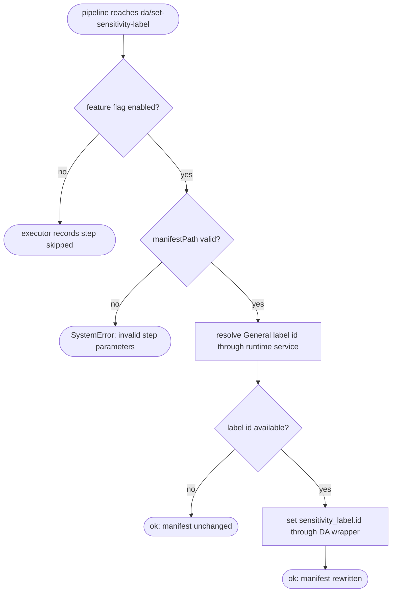

# Operation — `set-declarative-agent-sensitivity-label`

- **Status:** Accepted — ready for tests
- **Domain:** [`01-scaffolding`](../../domains/01-scaffolding.md)
- **Decision source:** [ADR-0017](../../../02-architecture/adr/ADR-0017-named-pipeline-step-whitelist.md)
- **Step:** `da/set-sensitivity-label`
- **PRD/scenario:** no change required — this preserves the existing v3
  feature-flagged post-render behavior while moving its owner into the v4
  pipeline.

## Purpose

Apply the tenant's General sensitivity label to a newly rendered Declarative
Agent manifest when `TEAMSFX_SENSITIVITY_LABEL` is enabled. The named pipeline
step factory captures a narrow service that resolves the General label id
without interactive sign-in, while the generic step context provides the
`DeclarativeAgentManifestWrapper` that applies that id to the manifest. Label lookup
is best-effort: authentication or Graph failures never fail scaffolding.

## Inputs

| Input                     | Type                                        | Origin                                                                                                                             |
| ------------------------- | ------------------------------------------- | ---------------------------------------------------------------------------------------------------------------------------------- |
| `manifestPath`            | non-empty target-relative string            | package `pipeline.json` step `with`                                                                                                |
| `generalSensitivityLabel` | `resolveId(): Promise<string \| undefined>` | dependency captured when the named step is registered; `undefined` means signed out, no token, no General label, or lookup failure |
| `manifestWrapper`         | Declarative Agent wrapper adapter           | injected pipeline runtime                                                                                                          |

The package owns the feature-flag guard:

```json
{
  "step": "da/set-sensitivity-label",
  "when": "featureFlag('TEAMSFX_SENSITIVITY_LABEL')",
  "with": {
    "manifestPath": "appPackage/declarativeAgent.json"
  }
}
```

## Outputs

The step returns `Result<void, FxError>`:

- when a label id is resolved, the manifest at `manifestPath` is rewritten with
  `sensitivity_label.id` set to that id;
- when no label id is resolved, the step succeeds without changing the file;
- invalid step parameters or a wrapper failure are engine invariant errors and
  return `SystemError`.

## Acceptance Criteria

| ID      | Runtime | Purpose               | Gate     | Harness              | Given                                                                                                                                          | When                             | Then                                                                                                  |
| ------- | ------- | --------------------- | -------- | -------------------- | ---------------------------------------------------------------------------------------------------------------------------------------------- | -------------------------------- | ----------------------------------------------------------------------------------------------------- |
| SENS-01 | L1      | operation-integration | required | named-step fake port | a non-empty `manifestPath` and the runtime service resolves `general-label-id`                                                                 | apply `da/set-sensitivity-label` | the Declarative Agent wrapper sets `sensitivity_label.id` to `general-label-id` and the step succeeds |
| SENS-02 | L1      | operation-integration | required | named-step fake port | the runtime service returns `undefined` because the user is signed out, no token is available, no General label exists, or Graph lookup failed | apply `da/set-sensitivity-label` | the wrapper is not called, the manifest remains unchanged, and the step succeeds                      |
| SENS-03 | L1      | operation-integration | required | named-step fake port | `manifestPath` is absent or empty                                                                                                              | validate the step parameters     | validation rejects the invocation before authentication or manifest mutation                          |

## Flow



## Boundary

This operation does **not**:

- prompt for sign-in, consent, or label selection;
- own token acquisition, Graph request construction, retry, cache, or label-name
  matching — those stay behind the step-owned injected service;
- parse or mutate manifest JSON directly — all mutation routes through
  `DeclarativeAgentManifestWrapper`;
- add a capability-specific branch, service field, or dependency to the generic
  pipeline executor, runtime port, or step context;
- apply a label when the feature flag is disabled.

## Invariants

- **INV-1 — Best effort.** Signed-out state, missing token, missing General
  label, and Graph failures resolve to `undefined`; none can fail scaffolding.
- **INV-2 — Non-interactive.** Lookup checks existing authentication state and
  never opens an authentication dialog.
- **INV-3 — No secret exposure.** Tokens are not passed to the step, written to
  scaffold output, or logged.
- **INV-4 — Wrapper-owned mutation.** The step never parses or serializes the
  Declarative Agent manifest itself.
- **INV-5 — Enumerable behavior.** Every affected package declares the named
  step and feature-flag guard in `pipeline.json`; no route or runtime infers the
  behavior from a template id.
- **INV-6 — Single owner.** Template bodies do not conditionally render
  `sensitivity_label`; the post-render step is the only owner of that field.
- **INV-7 — Step-owned dependency.** The sensitivity-label service is captured
  by the registered step factory. Generic pipeline and runtime contracts carry
  only the step registry and never name this service.

The real-package and route-compatibility contract is owned by
[`apply-general-sensitivity-label`](../../scenarios/da/apply-general-sensitivity-label.md).
