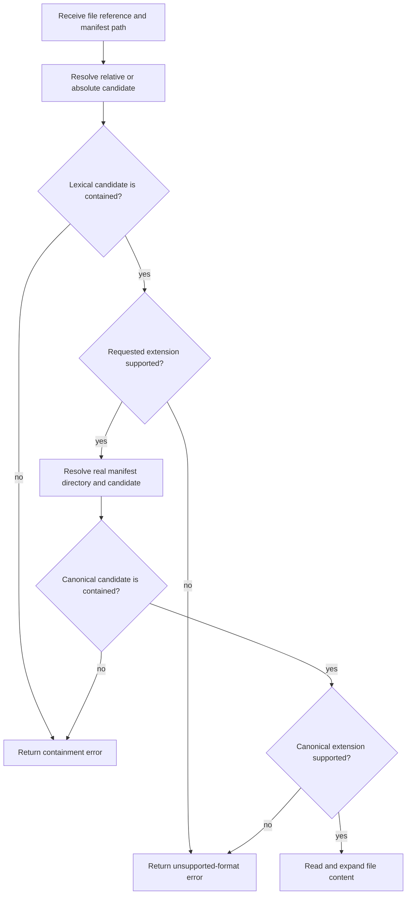

# Resolve Manifest File Reference

- **Status:** Approved
- **Domain:** Manifest security
- **Owner:** Microsoft 365 Agents Toolkit maintainers
- **Requirement source:** Private security report reviewed on August 5, 2026
- **Product impact:** Existing manifest packaging remains supported, while file references are
  restricted to their manifest directory.

## Purpose

Resolve `$[file()]` references without allowing a manifest to read files outside its own
directory tree.

## Inputs

| Input          | Type   | Required | Description                                                        |
| -------------- | ------ | -------: | ------------------------------------------------------------------ |
| file reference | string |      yes | Relative or absolute `.txt` or `.md` path supplied to `$[file()]`. |
| manifest path  | path   |      yes | Manifest containing the reference and defining the trusted root.   |

## Outputs

The operation returns the referenced text when the real file is contained by the manifest
directory. Invalid references return an `FxError` and no package artifact is produced.

## Acceptance Criteria

| ID         | Runtime | Purpose               | Gate     | Harness        | Given                                                                                     | When                             | Then                                                                                                                                                                                         |
| ---------- | ------- | --------------------- | -------- | -------------- | ----------------------------------------------------------------------------------------- | -------------------------------- | -------------------------------------------------------------------------------------------------------------------------------------------------------------------------------------------- |
| FILE-AC-01 | L1      | operation-integration | required | TempDirRuntime | A relative `.txt` or `.md` reference resolves inside the manifest directory               | The reference is expanded        | The file content is returned.                                                                                                                                                                |
| FILE-AC-02 | L1      | operation-integration | required | TempDirRuntime | A relative reference resolves through `..` outside the manifest directory                 | The reference is expanded        | A `FileReferenceOutsideManifestDirectory` error is returned.                                                                                                                                 |
| FILE-AC-03 | L1      | operation-integration | required | TempDirRuntime | An absolute `.txt` or `.md` reference resolves inside the manifest directory              | The reference is expanded        | The file content is returned.                                                                                                                                                                |
| FILE-AC-04 | L1      | operation-integration | required | TempDirRuntime | A path inside the manifest directory resolves through a symbolic link to an external file | The reference is expanded        | A `FileReferenceOutsideManifestDirectory` error is returned.                                                                                                                                 |
| FILE-AC-05 | L1      | operation-integration | required | TempDirRuntime | A `.txt` or `.md` reference resolves to a canonical target with another extension         | The reference is expanded        | An `UnsupportedFileFormat` error is returned.                                                                                                                                                |
| FILE-AC-06 | L1      | operation-integration | required | TempDirRuntime | An environment variable or nested `file()` produces an external reference                 | The reference is expanded        | The same containment policy rejects the external reference.                                                                                                                                  |
| FILE-AC-07 | L1      | scenario              | required | TempDirRuntime | A package contains an external `$[file()]` reference                                      | Package creation runs            | Creation fails and neither resolved JSON nor a ZIP containing external content is produced.                                                                                                  |
| FILE-AC-08 | L2      | scenario              | tracked  | CLI E2E        | A scaffolded Declarative Agent references an external `.txt` file through `../` traversal | `atk package` runs               | The command fails without exposing the path or content and produces no resolved JSON or ZIP.                                                                                                 |
| FILE-AC-09 | L1      | operation-integration | required | TempDirRuntime | An absolute reference resolves outside the manifest directory or across Windows drives    | The reference is expanded        | A `FileReferenceOutsideManifestDirectory` error is returned without reading the target.                                                                                                      |
| FILE-AC-10 | L1      | operation-integration | required | TempDirRuntime | A file reference resolves lexically or canonically outside the manifest directory         | The error is surfaced in VS Code | The local output identifies the reference, resolved target, and manifest directory, and advises moving the file and updating the reference; the telemetry-facing error omits absolute paths. |
| ZIP-AC-01  | L1      | operation-integration | required | TempDirRuntime | Any manifest asset resolves lexically or canonically outside the app package directory    | Package creation runs            | An `InvalidFileOutsideOfTheDirectotryError` is returned before the source is added.                                                                                                          |
| ZIP-AC-02  | L1      | scenario              | required | TempDirRuntime | An agent skill contains a symbolic link or junction to an external file or directory      | Package creation runs            | The linked entry and its external contents are omitted from the package.                                                                                                                     |
| ZIP-AC-03  | L1      | scenario              | required | TempDirRuntime | Package validation or output publication fails                                            | Package creation runs            | No new final ZIP or partially published resolved JSON remains.                                                                                                                               |
| ZIP-AC-04  | L1      | operation-integration | required | TempDirRuntime | A package source is rejected for leaving the trusted directory                            | The error is surfaced            | The telemetry-facing error message does not disclose a resolved absolute host path.                                                                                                          |
| ZIP-AC-05  | L1      | scenario              | required | TempDirRuntime | Publishing staged package outputs fails                                                   | The error is surfaced            | The local display message identifies the output path, the telemetry-facing message omits absolute paths, and prior outputs are restored.                                                     |
| ZIP-AC-06  | L1      | operation-integration | required | TempDirRuntime | Canonicalizing a package source fails                                                     | The error is surfaced            | The local display message identifies the source path and the telemetry-facing message omits absolute paths.                                                                                  |

## Flow

## Boundary

This operation does not broaden supported file formats, allow references relative to the
project root, execute lifecycle actions, or upload package artifacts. The ZIP package boundary
also covers files named by the Teams manifest, Declarative Agent manifest, API plugin manifest,
embedded knowledge capabilities, agent skills, and agent connectors.

Containment is evaluated against the filesystem state at canonicalization time. Concurrent
filesystem mutation between canonicalization and reading requires platform-specific handle
APIs that Node.js does not expose consistently and is outside this operation's threat model.

## Invariants

1. Relative and absolute references are accepted only when their lexical and canonical targets
   remain inside the manifest directory.
2. A candidate whose canonical path is outside the canonical manifest directory at resolution
   time is never read.
3. Containment handles parent traversal, sibling-prefix paths, symbolic links, and Windows
   cross-drive paths.
4. Telemetry-facing error messages do not expose resolved local absolute paths. Local display
   messages and logs may include user-actionable paths.
5. Relative and absolute `.txt` and `.md` references inside the manifest directory remain valid.
6. Every filesystem source added to an app package is lexically and canonically contained by the
   app package directory.
7. Directory packaging never follows symbolic links or junctions.
8. The ZIP and every resolved JSON file are staged before any existing final output is modified.
9. A failed package operation does not publish a new final ZIP or partial resolved JSON output.
