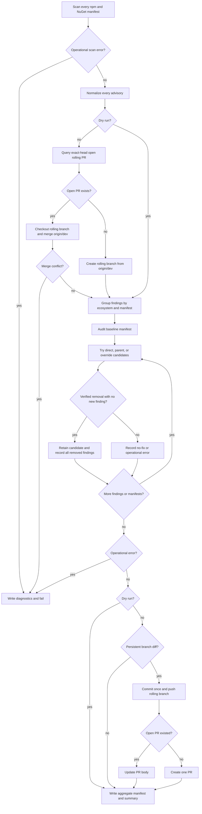

# Roll Vulnerability Fixes

- **Status:** Approved
- **Domain:** Repository security maintenance
- **Owner:** Microsoft 365 Agents Toolkit maintainers
- **Requirement source:** Maintainer request in the July 14, 2026 vulnerability
  pipeline investigation
- **Product impact:** None. This operation changes repository automation, not a
  shipped Toolkit surface, so no PRD or product scenario changes are required.

## Purpose

Scan every supported template manifest, preserve every vulnerability finding,
apply every safe automatic fix, and maintain all verified changes in one rolling
pull request.

## Inputs

| Input | Type | Required | Description |
|---|---|---:|---|
| npm scan roots | path list | yes | Roots containing `package.json` and `package.json.tpl` files. |
| NuGet scan roots | path list | yes | Roots containing `.csproj` and `.csproj.tpl` files. |
| base branch | string | yes | Branch receiving the eventual fixes; currently `dev`. |
| rolling branch | string | yes | Stable automation branch; `auto-fix-vuln/rolling`. |
| repository | GitHub owner/name | yes outside dry-run | Repository queried and updated through `gh`. |
| dry-run | boolean | no | Evaluates and reports fixes without persistent mutations. |

## Outputs

The operation writes scanner artifacts and one aggregate result manifest with:

- scan target and normalized finding counts;
- verified fixes;
- findings already fixed on the open rolling branch;
- findings without a verified automatic fix;
- operational errors;
- rolling branch identity; and
- pull request action, number, and URL.

The same result categories drive the Actions summary, email, and rolling pull
request body.

## Acceptance Criteria

| ID | Runtime | Purpose | Gate | Harness | Given | When | Then |
|---|---|---|---|---|---|---|---|
| VULN-AC-01 | L1 | operation-integration | required | TempDirCommandHarness | One npm manifest whose audit JSON contains several packages and several advisories for one package | The npm scan completes | Every advisory is emitted as a normalized finding with its file, package, severity, advisory identity, direct/transitive status, and fix metadata. |
| VULN-AC-02 | L1 | operation-integration | required | TempDirCommandHarness | One NuGet project whose structured audit contains direct and transitive packages with several advisories | The NuGet scan completes | Every direct and transitive advisory is emitted as a normalized finding with a stable advisory identity. |
| VULN-AC-03 | L1 | operation-integration | required | TempDirCommandHarness | Several findings affect one manifest and candidate dependency changes are available | Fix processing runs | Findings are processed cumulatively per manifest; a candidate is retained only when install or restore succeeds, target findings disappear, and no new finding appears. One change may resolve and record several advisories. |
| VULN-AC-04 | L1 | operation-integration | required | GitCommandFakeHarness | An exact-head rolling pull request is open and its branch is behind `dev` | The daily operation starts | The operation checks out the remote rolling branch, merges latest `origin/dev`, applies new verified fixes, pushes the branch, and updates that same pull request. |
| VULN-AC-05 | L1 | operation-integration | required | GitCommandFakeHarness | No rolling pull request is open and verified fixes produce a diff from latest `origin/dev` | Publishing runs | The operation creates `auto-fix-vuln/rolling` from latest `origin/dev`, pushes it, and opens exactly one pull request. |
| VULN-AC-06 | L1 | compatibility | required | GitCommandFakeHarness | A closed or merged historical rolling pull request exists, but no rolling pull request is currently open | New verified fixes are available | Historical pull requests do not suppress the work; the stable branch is safely recreated and a new pull request is opened. |
| VULN-AC-07 | L1 | operation-integration | required | GitCommandFakeHarness | No open rolling pull request exists and processing produces no diff | Publishing runs | No commit, push, or pull request is created. If an open rolling branch only gains the required `dev` merge, that synchronization may be pushed without creating an empty fix commit. |
| VULN-AC-08 | L1 | operation-integration | required | TempDirCommandHarness | A finding has no candidate or every candidate is incompatible or ineffective | Processing completes | The finding is reported in `no_fix`; no placeholder change is written, and the presence of the finding alone does not fail the workflow. |
| VULN-AC-09 | L1 | operation-integration | required | TempDirCommandHarness | A scanner command, audit parser, branch merge, push, or pull request API operation cannot complete reliably | The operation reaches that boundary | The operation records a diagnostic error, returns a failing status, and does not publish partial unverified file changes. A candidate-specific dependency conflict remains a no-fix candidate result rather than an infrastructure failure. |
| VULN-AC-10 | L1 | operation-integration | required | InMemoryRenderHarness | An aggregate manifest contains fixed, already-fixed, no-fix, error, and pull request action records | Markdown, HTML email, subject, and PR body are rendered | Every surface reports counts and records from the same categories without legacy per-PR-limit or historical-branch buckets. |
| VULN-AC-11 | L1 | operation-integration | required | TempDirCommandHarness | The operation is invoked with `--dry-run` | Scanning and fix evaluation complete | Result buckets are populated, but source manifests, Git state, remote branches, and GitHub pull requests are unchanged. |

## Flow

## Boundary

This operation does not:

- change application runtime dependency policy;
- merge or close the rolling pull request;
- force-push over an open pull request branch;
- add top-level NuGet references solely to override transitive packages;
- create placeholder files for manual fixes;
- treat an unresolved vulnerability as an infrastructure failure;
- claim a fix without install or restore plus audit verification; or
- change product PRDs, Toolkit commands, VS Code behavior, or scaffold output
  except for dependency versions in templates changed by a reviewed fix PR.

## Invariants

1. At most one pull request with head `auto-fix-vuln/rolling` is open.
2. A closed or merged historical pull request never suppresses a current
   finding.
3. Every normalized finding appears in exactly one terminal result category:
   `fixed`, `already_fixed`, `no_fix`, or `errors`.
4. No candidate is persisted when it leaves a target finding present or adds a
   new finding.
5. Operational errors prevent all pending file changes from being committed or
   pushed.
6. The rolling branch incorporates latest `origin/dev` before new fixes are
   published.
7. Merge conflicts are reported and never resolved by force-push or data loss.
8. Dry-run performs no source, Git, or GitHub mutation.
9. Paths from artifacts are resolved inside the repository root before any
   read or write.

