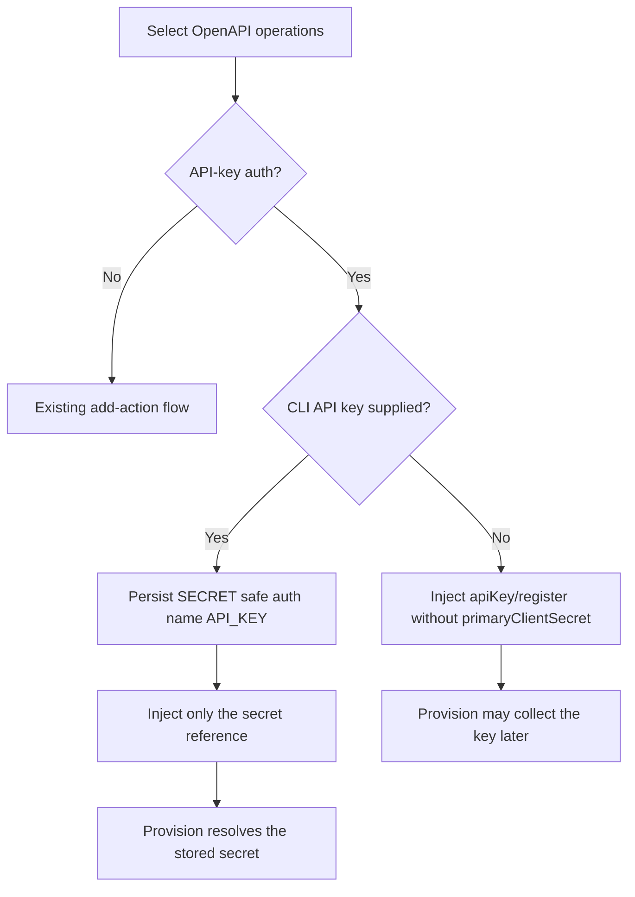

# Add OpenAPI API-Key Action

## Scope

This scenario covers adding an action from an existing OpenAPI document whose selected operations use API-key authentication. The CLI may collect the API-key value while adding the action, but provision remains the fallback owner when no value is supplied.

## Acceptance Criteria

| ID                     | Tier | Given                                                                                                   | When                                       | Then                                                                                                                                                                                                                            |
| ---------------------- | ---- | ------------------------------------------------------------------------------------------------------- | ------------------------------------------ | ------------------------------------------------------------------------------------------------------------------------------------------------------------------------------------------------------------------------------- |
| SCN-ADD-OPENAPI-KEY-01 | L1   | `atk add action --api-plugin-type api-spec` and selected operations use API-key authentication          | CLI options/questions are inspected        | optional `--api-key` is available; interactive CLI shows a password-style optional question; VS Code does not show it                                                                                                           |
| SCN-ADD-OPENAPI-KEY-02 | L1   | API-key value supplied, with v4 either off or on                                                        | add action completes                       | `apiKey/register` includes `primaryClientSecret: ${{SECRET_<SAFE_AUTH_NAME>_API_KEY<UNIQUE_SUFFIX>}}`, where `<UNIQUE_SUFFIX>` matches the suffix allocated to a non-default registration ID; plaintext is absent from workflow YAML and regular environment files; the value is persisted through encrypted user-environment storage |
| SCN-ADD-OPENAPI-KEY-03 | L1   | API-key value omitted, with v4 either off or on                                                         | add action completes                       | `apiKey/register` has no `primaryClientSecret`, no API-key secret is persisted, and the existing provision-time question remains available                                                                                      |
| SCN-ADD-OPENAPI-KEY-04 | L2   | basic declarative agent and the repair-service OpenAPI URL, with v4 off/on and API-key supplied/omitted | real `node cli.js add action` commands run | all four runs succeed and satisfy SCN-ADD-OPENAPI-KEY-02 or SCN-ADD-OPENAPI-KEY-03 as applicable                                                                                                                                |
| SCN-ADD-OPENAPI-KEY-05 | L1   | separate OpenAPI actions use the same API-key security-scheme name                                      | each action is added with an API-key value | each registration references and persists a distinct secret name using its registration uniqueness suffix; adding a later action does not overwrite an earlier action's key                                                                                           |

## Flow

## Boundary

- This scenario does not change OAuth or unauthenticated OpenAPI actions.
- This scenario does not add an API-key option to the provision command.
- This scenario does not expose the add-time API-key question in VS Code.
- This scenario does not require the optional value in non-interactive CLI use.

## Invariants

- Plaintext API keys never appear in workflow YAML or regular environment files.
- Secret values are written only through the existing encrypted user-environment path.
- Omitting `--api-key` preserves the existing provision-time collection flow.
- V4 feature state does not change the observable OpenAPI add-action result.
- Separate OpenAPI registrations never share secret storage merely because their security-scheme names match.
