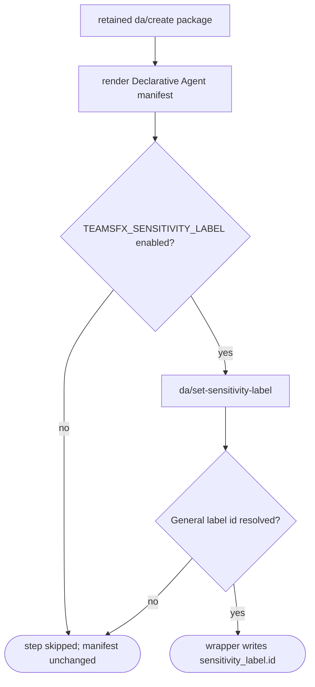

# Scenario — Apply General Sensitivity Label to a Declarative Agent

- **Status:** Accepted — ready for scenario and compatibility tests
- **Domain:** [`01-scaffolding`](../../domains/01-scaffolding.md)
- **Scenario ID:** `SCN-DA-SENSITIVITY-LABEL`
- **Template ids:** all retained `da/*` create packages
- **PRD/scenario:** no product change required — this preserves the existing v3
  feature-flagged post-render behavior during v4 replacement.

This is the vertical contract for applying the tenant's General sensitivity
label across Declarative Agent create packages. The package explicitly declares
the feature-flagged named step; a fake label service keeps L1 runs offline and
proves the manifest outcome without coupling scenario tests to authentication or
Graph.

## Acceptance Criteria

| ID          | Runtime | Purpose       | Gate     | Harness                                 | Given                                                                                            | When                                | Then                                                                                                                                                                                                                                         |
| ----------- | ------- | ------------- | -------- | --------------------------------------- | ------------------------------------------------------------------------------------------------ | ----------------------------------- | -------------------------------------------------------------------------------------------------------------------------------------------------------------------------------------------------------------------------------------------- |
| SCN-SENS-01 | L1      | scenario      | required | InMemoryRuntime with fake label service | `da/no-action`, `TEAMSFX_SENSITIVITY_LABEL` enabled, and the service resolves `general-label-id` | scaffold                            | `da/set-sensitivity-label` runs after render and `appPackage/declarativeAgent.json` contains `sensitivity_label.id == "general-label-id"`                                                                                                    |
| SCN-SENS-02 | L1      | scenario      | required | InMemoryRuntime with call-counting fake | the same package with the feature flag disabled                                                  | scaffold                            | the step is skipped, the service is not called, and the manifest has no `sensitivity_label`                                                                                                                                                  |
| SCN-SENS-03 | L1      | compatibility | required | v3/v4 route matrix                      | each retained v4 Declarative Agent create route that v3 labels after render                      | inspect its descriptor and pipeline | the route requires engine `6.11.0` or newer and declares exactly one `da/set-sensitivity-label` step guarded by `featureFlag('TEAMSFX_SENSITIVITY_LABEL')`, after `require-empty-target`, targeting its generated Declarative Agent manifest |

## Composed operations

- [`build-render-context`](../../operations/scaffolding/build-render-context.md)
  — supplies the shared feature-flag expression runtime; it does not produce a
  sensitivity-label render variable.
- [`run-scaffold-pipeline`](../../operations/scaffolding/run-scaffold-pipeline.md)
  — evaluates the package-owned guard and dispatches the registered step after
  render.
- [`set-declarative-agent-sensitivity-label`](../../operations/scaffolding/set-declarative-agent-sensitivity-label.md)
  — owns label resolution and wrapper-routed manifest mutation semantics.

## Flow

## Boundary

This scenario does **not** assert real authentication or Graph availability;
those are external runtime adapter concerns. It does not add a prompt or CLI/UI
surface. It does not cover modify packages, because v3 applies the General label
during Declarative Agent creation rather than add-action flows.
