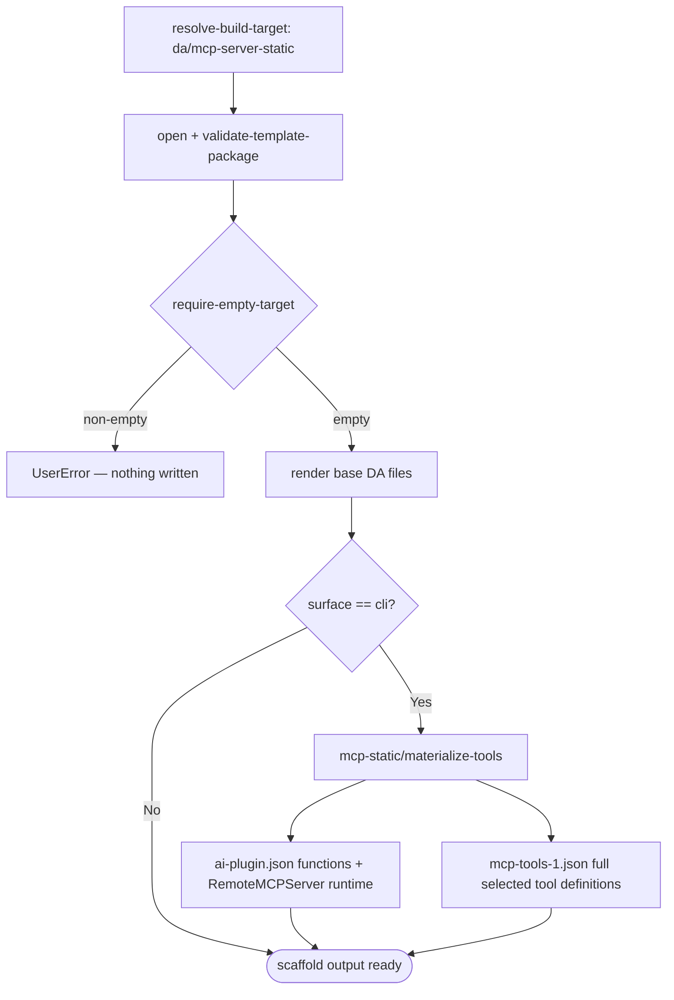

# Scenario — Create Declarative Agent with Static MCP Tools (`da/mcp-server-static`)

- **Status:** Implemented compatibility route; retained until the DT flag is removed
- **Domain:** [`01-scaffolding`](../../domains/01-scaffolding.md)
- **Scenario ID:** `SCN-DA-CREATE-WITH-MCP-SERVER` (DT-off implementation state of
  product scenario
  [`create-da-with-mcp-server.md`](../../../01-product/scenarios/da/create-da-with-mcp-server.md))
- **Template id:** `da/mcp-server-static` (create)

This is the DT-off v4 create contract for MCP-backed Declarative Agents.
`TEAMSFX_MCP_FOR_DA_DT` now defaults to `true`, so this is a compatibility
route rather than the default experience. Keep this route, its spec, and its
tests until the feature flag and selector route are deleted. It
keeps the legacy static-tools artifact shape inside the v4 scaffolding runtime:
selected MCP tools are materialized into `appPackage/mcp-tools-1.json`, and
`appPackage/ai-plugin.json` references that file through a `RemoteMCPServer`
runtime. The route is selected when `TEAMSFX_MCP_FOR_DA_DT == false`; the
template's questions and post-render step then branch by surface. VS Code asks
only for `mcpServerUrl` during create and leaves tool discovery to the follow-up
MCP CodeLens flow. CLI asks for an optional static MCP tools file path; when the
path is omitted, Q2 fetches tools from `mcpServerUrl`. If that fetch discovers an
auth-required server, create fails instead of scaffolding incomplete static tool
artifacts. The DT-on dynamic runtime shape
remains owned by [`da/mcp-server`](create-mcp-server.md).

## Acceptance Criteria

| ID                       | Tier | Given                                                                                                       | When                      | Then                                                                                                                                            |
| ------------------------ | ---- | ----------------------------------------------------------------------------------------------------------- | ------------------------- | ----------------------------------------------------------------------------------------------------------------------------------------------- |
| SCN-CREATE-MCP-STATIC-01 | L1   | `surface="cli"`, `mcpServerUrl`, `mcpToolsFilePath`, `selectedMcpTools=["search","calendar"]`, empty target | scaffold completes        | render writes the base DA files and the static MCP step writes `appPackage/mcp-tools-1.json`                                                    |
| SCN-CREATE-MCP-STATIC-02 | L1   | `selectedMcpTools=["search"]` and `mcpToolsFilePath` points to tools containing `search` + `calendar`       | scaffold completes        | `ai-plugin.json.functions` contains only `search`, and `mcp-tools-1.json.tools` contains only the full `search` tool definition                 |
| SCN-CREATE-MCP-STATIC-03 | L1   | static MCP scaffold output                                                                                  | inspect `ai-plugin.json`  | `runtimes[0].spec.mcp_tool_description.file == "mcp-tools-1.json"`, `run_for_functions == ["search"]`, and `enable_dynamic_discovery` is absent |
| SCN-CREATE-MCP-STATIC-04 | L1   | non-empty target                                                                                            | scaffold                  | `require-empty-target` fails first with **`UserError`** and writes nothing                                                                      |
| SCN-CREATE-MCP-STATIC-05 | L1   | `surface="vscode"`, `mcpServerUrl`, empty target                                                            | scaffold completes        | render writes the base DA files, skips `mcp-static/materialize-tools`, and does not write `appPackage/mcp-tools-1.json`                         |
| SCN-CREATE-MCP-STATIC-06 | L1   | `surface="cli"`, `mcpServerUrl`, no `mcpToolsFilePath`                                                      | Q2 reaches tool selection | tools are fetched from `mcpServerUrl` and listed for selection                                                                                  |
| SCN-CREATE-MCP-STATIC-07 | L1   | `surface="cli"`, `mcpServerUrl`, no `mcpToolsFilePath`, and the server requires auth                        | Q2 fetches tools          | create fails with **`UserError`** before scaffold writes files                                                                                  |

## Executable validation

- **Authored package:**
  [`templates/v4/create/da/mcp-server-static`](../../../../templates/v4/create/da/mcp-server-static)
  supplies the real `descriptor.json`, `questions.json`, `pipeline.json`, and
  recursive `content/` bytes. The test does not substitute a fixture package.
- **Harness:**
  [`createMcpServerStatic.test.ts`](../../../../packages/fx-core/tests/v4/scenarios/createMcpServerStatic.test.ts)
  loads those bytes through
  [`loadV4Package`](../../../../packages/fx-core/tests/v4/scenarios/helpers/scenarioHarness.ts),
  then calls the production `scaffold` entry under `InMemoryRuntime`.
- **Traceability:** seven tests map 1:1 to the seven AC rows above. They inspect
  the rendered base DA files, selected function projection, full tool
  definitions, runtime shape, empty-target guard, VS Code skip branch, and CLI
  fetch/auth-required branches.
- **External boundary:** MCP tool fetch is injected at the network edge so the
  test is deterministic. This validates authored package execution and Q2
  behavior, not connectivity to a live MCP server or the VS Code UI.

Run the focused validation from the repository root:

```bash
pnpm --dir packages/fx-core exec vitest run --config vitest.config.ts tests/v4/scenarios/createMcpServerStatic.test.ts
```

## Flow



## Boundary

This scenario does not assert the DT-on dynamic discovery shape; that remains in
[`create-mcp-server.md`](create-mcp-server.md). It also does not assert the VS
Code follow-up CodeLens flow, which remains owned by
`SCN-DA-FETCH-MCP-TOOLS`; this is the scaffold-output contract over the v4
runtime after the CLI has supplied static MCP tools, plus the VS Code create
contract that static tool materialization is skipped.
