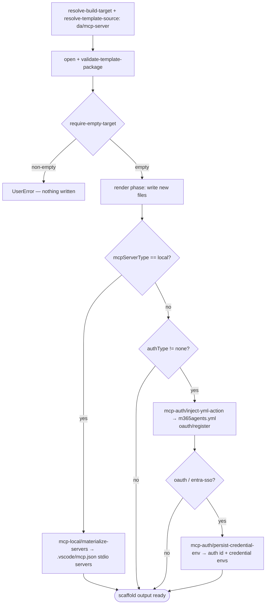

# Scenario — Create Declarative Agent with MCP Server (`da/mcp-server`)

- **Status:** Implemented and covered at scenario tier (T3)
- **Domain:** [`01-scaffolding`](../../domains/01-scaffolding.md)
- **Scenario ID:** `SCN-DA-CREATE-WITH-MCP-SERVER` (mirrors product scenario
  [`create-da-with-mcp-server.md`](../../../01-product/scenarios/da/create-da-with-mcp-server.md))
- **Template id:** `da/mcp-server` (create)

This is the **vertical** contract for one template: what scaffolding the
`da/mcp-server` create package produces **end-to-end**. It **composes** the
_horizontal_ scaffolding operation specs (linked under
[Composed operations](#composed-operations)) and adds only the **concrete**
artifacts _this_ template emits — the rendered `ai-plugin.json` namespace, the
`m365agents.yml` auth wiring, the `MCP_DA_AUTH_ID_*` env var. Mechanism (how the
render phase writes, how a step mutates a manifest) is **not** restated here; it
lives in the composed operation specs. Per the
[specs README](../../README.md#operation-spec-vs-scenario-spec--orthogonal-cuts-not-duplication),
these AC rows are the source of the ADR-0018 **T3** assertions, run with the
whole template scaffolded under `InMemoryRuntime` (hence every row is **L1**).

Within the v4 engine, this is the default MCP create route because
`TEAMSFX_MCP_FOR_DA_DT` defaults to `true`.
`TEAMSFX_MCP_FOR_DA_DCR` also defaults to `true`; the `oauth-dynamic` option is
available only while both flags are true. The DT-off compatibility
implementation remains in
[`da/mcp-server-static`](create-mcp-server-static.md) under the same stable
product Scenario ID.

`TEAMSFX_V4_ENABLED` still defaults to `false`, so this spec intentionally owns
the v4 preview package rather than the shipped v3 generator. Both
implementations rely on the host's implicit dynamic-discovery shape and now
share the same credential flow: Create collects the static OAuth or Entra
values, persists environment references, and leaves cloud registration to
Provision.

## Acceptance Criteria

| ID                | Tier | Given                                                                                                                           | When                  | Then                                                                                                                                                                                                                                                                                                                          |
| ----------------- | ---- | ------------------------------------------------------------------------------------------------------------------------------- | --------------------- | ----------------------------------------------------------------------------------------------------------------------------------------------------------------------------------------------------------------------------------------------------------------------------------------------------------------------------- |
| SCN-CREATE-MCP-01 | L1   | `authType=none`, empty target                                                                                                   | scaffold completes    | the render phase writes the new files `appPackage/ai-plugin.json`, `appPackage/declarativeAgent.json`, `appPackage/manifest.json`, `m365agents.yml`, `.vscode/mcp.json`, `env/.env.dev`, `README.md`, `evals/prompts.json` (new-files-only)                                                                                   |
| SCN-CREATE-MCP-02 | L1   | rendered `appPackage/ai-plugin.json`                                                                                            | URL-derived namespace | `namespace == mcpNamespace(mcpServerUrl)` (host `https://api.github.com/…` → `apigithubc`), never `action_1`                                                                                                                                                                                                                  |
| SCN-CREATE-MCP-03 | L1   | rendered `ai-plugin.json` runtime                                                                                               | always                | `runtimes[0].type == "RemoteMCPServer"`, `spec == { url: mcpServerUrl }` (no `mcp_tool_description` or `enable_dynamic_discovery`), `run_for_functions == ["*"]`                                                                                                                                                              |
| SCN-CREATE-MCP-04 | L1   | `authType=none`                                                                                                                 | render                | `runtimes[0].auth.type == "None"`; `mcp-auth/inject-yml-action` is in `stepsSkipped`                                                                                                                                                                                                                                          |
| SCN-CREATE-MCP-05 | L1   | `authType=oauth`                                                                                                                | render + steps        | `auth.type == "OAuthPluginVault"`, `auth.reference_id == mcpAuthRef(mcpServerUrl)`; `mcp-auth/inject-yml-action` runs, injecting the `oauth/register` action into `m365agents.yml`                                                                                                                                            |
| SCN-CREATE-MCP-06 | L1   | `authType` ∈ {`oauth`, `entra-sso`}                                                                                             | persist step          | `mcp-auth/persist-credential-env` runs, writing `MCP_DA_AUTH_ID_<NS>` (e.g. `MCP_DA_AUTH_ID_APIGITHUBC`) into `env/.env.dev`                                                                                                                                                                                                  |
| SCN-CREATE-MCP-07 | L1   | `authType=none`                                                                                                                 | persist step          | `mcp-auth/persist-credential-env` is skipped (`when` false); no `MCP_DA_AUTH_ID_*` env var is written                                                                                                                                                                                                                         |
| SCN-CREATE-MCP-08 | L1   | base `m365agents.yml`                                                                                                           | render phase          | rendered as the `version: v1.12` skeleton **without** the auth step (auth wiring is post-render step injection, never render)                                                                                                                                                                                                 |
| SCN-CREATE-MCP-09 | L1   | non-empty target                                                                                                                | scaffold              | `require-empty-target` fails first with **`UserError`** and writes nothing (the create contract; ordering mechanism owned by `run-scaffold-pipeline`)                                                                                                                                                                         |
| SCN-CREATE-MCP-10 | L1   | identical inputs re-run                                                                                                         | scaffold              | deterministic — identical `written` set and identical manifest namespace / `reference_id` (URL-derived, no `action_1` drift)                                                                                                                                                                                                  |
| SCN-CREATE-MCP-11 | L1   | `mcpServerType=local`, `selectedLocalServers=["ghmcp"]`, a `localServerCatalog` mapping `ghmcp → {command, args}`, empty target | scaffold completes    | `mcp-local/materialize-servers` overwrites the render-phase stub: `.vscode/mcp.json` `servers.ghmcp == {type:"stdio", command, args}` and is the **only** key (the remote stub is gone)                                                                                                                                       |
| SCN-CREATE-MCP-12 | L1   | `mcpServerType=local`, `selectedLocalServers=["ghmcp","filesystem"]`                                                            | scaffold              | every selected id is its own stdio entry — `servers` has **both** keys, each `type:"stdio"` with its catalog `command` / `args`                                                                                                                                                                                               |
| SCN-CREATE-MCP-13 | L1   | `mcpServerType=local`                                                                                                           | render + steps        | the local branch is faithful to the empty-runtimes stub: `ai-plugin.json` `runtimes == []`, and both `mcp-auth/*` steps are in `stepsSkipped` (local has no remote URL to authenticate)                                                                                                                                       |
| SCN-CREATE-MCP-14 | L1   | `mcpServerType=local` with **no** `mcpServerUrl` answered                                                                       | scaffold              | the conditionally-skipped `mcpServerUrl` resolves to the empty string via [`build-render-context`](../../operations/scaffolding/build-render-context.md) declared-domain seeding (RCTX-12) — the shared remote `replaceMap` does **not** crash the local scaffold; `mcp-local/materialize-servers` is in `stepsRun`           |
| SCN-CREATE-MCP-15 | L1   | `authType=oauth`, required `oauthClientId` / `oauthClientSecret`, and non-empty optional `oauthScopes`                          | scaffold              | `oauth/register` references `MCP_DA_OAUTH_CLIENT_ID_<NS>`, `SECRET_MCP_DA_OAUTH_CLIENT_SECRET_<NS>`, and `MCP_DA_OAUTH_SCOPE_<NS>`; the regular environment contains client id, scopes, and `MCP_DA_AUTH_ID_<NS>=`; the plaintext secret exists only in the injected secret-environment sink and in no ordinary scaffold file |
| SCN-CREATE-MCP-16 | L1   | `authType=oauth`, required credentials, and no scopes                                                                           | scaffold              | the OAuth client-id/client-secret references and values are persisted as in SCN-CREATE-MCP-15, but neither YAML nor the regular environment contains a dangling `MCP_DA_OAUTH_SCOPE_<NS>` reference/value                                                                                                                     |
| SCN-CREATE-MCP-17 | L1   | `authType=entra-sso` and required `entraClientId`                                                                               | scaffold              | `oauth/register` with `identityProvider: MicrosoftEntra` references only `MCP_DA_OAUTH_CLIENT_ID_<NS>`; the regular environment contains that value and `MCP_DA_AUTH_ID_<NS>=`; no client-secret or scope reference/value is written                                                                                          |
| SCN-CREATE-MCP-18 | L1   | `authType=oauth-dynamic`, `authType=none`, or `mcpServerType=local`                                                             | scaffold              | no static client id, client secret, scope value, or credential environment reference is written; dynamic registration retains `dcr/register`, while `none` and local retain their existing no-auth behavior                                                                                                                   |

The template schema limits `authType` to `none`, `oauth`, `entra-sso`, and
`oauth-dynamic`. The auth action also defensively rejects unknown values with
`McpAuthInjectFailed`; that extension-point guard is covered at file-unit tier,
not as a user-reachable scenario.

## Executable validation

- **Authored package:**
  [`templates/v4/create/da/mcp-server`](../../../../templates/v4/create/da/mcp-server)
  supplies the real `descriptor.json`, `questions.json`, `pipeline.json`, and
  recursive `content/` bytes. The test does not substitute a fixture package.
- **Harness:**
  [`createMcpServer.test.ts`](../../../../packages/fx-core/tests/v4/scenarios/createMcpServer.test.ts)
  loads those bytes through
  [`loadV4Package`](../../../../packages/fx-core/tests/v4/scenarios/helpers/scenarioHarness.ts),
  then calls the production `scaffold` entry under `InMemoryRuntime`.
- **Traceability:** eighteen tests map 1:1 to the eighteen AC rows above.
  They cover the remote dynamic-discovery shape, all four auth modes, lifecycle
  and env mutation, deterministic reruns, the empty-target guard, and one- and
  multi-server local `stdio` materialization.
- **External boundary:** OAuth and DCR metadata probes are stubbed at the
  network edge. This validates the authored package, production render and
  pipeline code, and generated handoff shape; it does not validate a live MCP
  or authorization server, provision execution, CLI parsing, or VS Code UI.

Run the focused validation from the repository root:

```bash
pnpm --dir packages/fx-core exec vitest run --config vitest.config.ts tests/v4/scenarios/createMcpServer.test.ts
```

## Composed operations

This scenario **flows through** these operation specs; their mechanics are
**referenced, never restated**:

- [`resolve-build-target`](../../operations/scaffolding/resolve-build-target.md)
  — selects the create build target (ADR-0014).
- [`resolve-template-source`](../../operations/scaffolding/resolve-template-source.md)
  — picks the `da/mcp-server` package and pins its `{version, digest}`
  (ADR-0006 / ADR-0015).
- [`open-template-package`](../../operations/scaffolding/open-template-package.md)
  - [`validate-template-package`](../../operations/scaffolding/validate-template-package.md)
    — opens and well-formed-checks the package (ADR-0015).
- [`run-scaffold-pipeline`](../../operations/scaffolding/run-scaffold-pipeline.md)
  — the two-phase executor: its **render phase** writes the new files in
  SCN-CREATE-MCP-01; its **`default` pipeline** runs `require-empty-target`,
  `mcp-auth/inject-yml-action`, `mcp-auth/persist-credential-env`, and — on the
  local branch — `mcp-local/materialize-servers` (ADR-0017). The render-var
  derivation (`mcpNamespace` / `mcpAuthRef` / `IsNoAuth` / `IsLocalMCP`) is owned
  by
  [ADR-0016](../../../02-architecture/adr/ADR-0016-declarative-template-format.md)
  (**Accepted** 2026-06-08 — SCN-CREATE-MCP-02/05's namespace and `reference_id`
  facts derive from it, as `run-scaffold-pipeline` does too).

## Flow

End-to-end scaffold output (outcome-focused; exact two-phase ordering is owned by
[`run-scaffold-pipeline`](../../operations/scaffolding/run-scaffold-pipeline.md),
and the user-journey across surfaces is the product scenario's flow):



For static OAuth and Entra SSO, the generated `oauth/register` action resolves
credentials from environment references written during Create. Client secrets
go through the encrypted user-environment writer and never through ordinary
scaffold file writes. Dynamic registration has no static credential prompt or
environment reference.

## Boundary

This scenario does **not** assert:

- **Surface mechanics** — the VS Code Quick Pick / input states and the CLI
  prompt-and-flag tree. Those trace to the product scenario
  [`create-da-with-mcp-server.md`](../../../01-product/scenarios/da/create-da-with-mcp-server.md)
  via CLI-E2E / UI smoke, not this scaffold-output contract.
- The DT-off VS Code CodeLens compatibility flow
  (`SCN-DA-FETCH-MCP-TOOLS`) or the separate add-action goal
  ([`SCN-DA-ADD-MCP-ACTION-TO-DA`](add-mcp-server.md)).
- The shipped v3 MCP generator's internal runtime marker. This spec requires
  equivalent user-visible credential collection and persistence, not shared
  implementation code.
- **How** a single file renders or **how** a step mutates a manifest — that
  mechanism is owned by the composed operation specs above.
- Tool discovery or a static `tools` list (the DT-off compatibility path).
- Provision execution itself. This scenario asserts the generated handoff shape
  that activates the existing `oauth/register` provision questions; the
  registration driver's remote side effects remain owned by its lifecycle
  tests.

## Invariants

- **INV-1** — Static OAuth and Entra SSO credentials are collected during
  Create; dynamic OAuth, `none`, and local MCP never collect or persist static
  credentials.
- **INV-2** — A client secret is accepted only by a masked question and written
  only through the secret-environment sink. It never appears in a regular env
  file, lifecycle YAML, manifest, warning, log, or other ordinary scaffold file.
- **INV-3** — Credential environment names and YAML references match the v3
  contract exactly: `MCP_DA_OAUTH_CLIENT_ID_<NS>`,
  `SECRET_MCP_DA_OAUTH_CLIENT_SECRET_<NS>`, and optional
  `MCP_DA_OAUTH_SCOPE_<NS>`.
