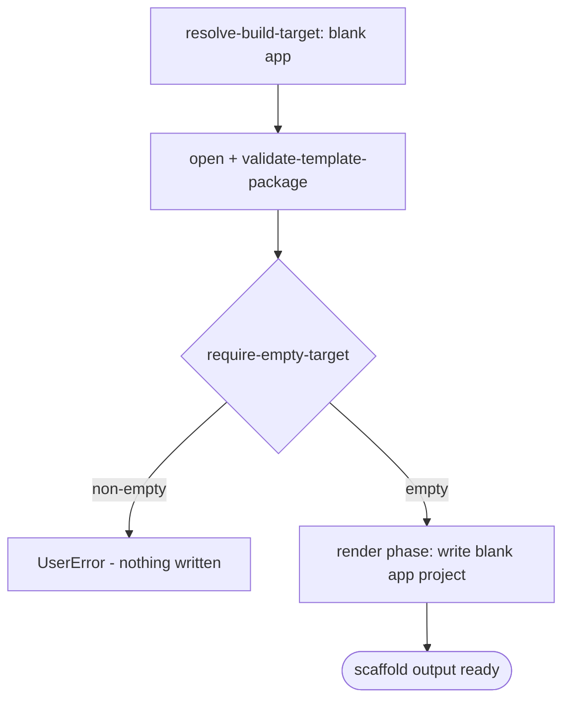

# Scenario - Create Blank App (`blank-app`)

- **Status:** Accepted (migration parity bug fix 2026-07-02) - ready for scenario-tier tests
- **Domain:** [`01-scaffolding`](../../domains/01-scaffolding.md)
- **Scenario ID:** `SCN-TEAMS-CREATE-BLANK-APP`
- **Template id:** `blank-app` (create)

This is the vertical contract for the native v4 blank app create package. The package is language-agnostic and pure render: scaffold writes the minimal Microsoft 365 app project structure and does not run post-render injection.

## Acceptance Criteria

| ID | Tier | Given | When | Then |
|----|------|-------|------|------|
| SCN-CREATE-BLANK-01 | L1 | empty target | scaffold completes | the render phase writes the blank app file set (`.tpl` stripped) including `.vscode`, `appPackage`, env, yaml, README, and gitignore files |
| SCN-CREATE-BLANK-02 | L1 | rendered manifest | render | manifest app names use the caller floor `appName`, preserve `${{APP_NAME_SUFFIX}}` and `${{TEAMS_APP_ID}}`, and remain blank by declaring no app capability blocks |
| SCN-CREATE-BLANK-03 | L1 | rendered `m365agents.yml` | render | the lifecycle skeleton preserves `version: v1.12`, renders the provision app name, and includes package validation/update/publish actions |
| SCN-CREATE-BLANK-04 | L1 | empty target | scaffold | only the `require-empty-target` step runs; no post-render scaffold injection is run |
| SCN-CREATE-BLANK-05 | L1 | non-empty target | scaffold | `require-empty-target` fails first with **`UserError`** and writes nothing |

## Composed operations

- [`resolve-build-target`](../../operations/scaffolding/resolve-build-target.md) - routes `projectType == 'blank-app-type'` to the `blank-app` v4 package.
- [`resolve-template-source`](../../operations/scaffolding/resolve-template-source.md), [`open-template-package`](../../operations/scaffolding/open-template-package.md), and [`validate-template-package`](../../operations/scaffolding/validate-template-package.md) - open and validate the package.
- [`build-render-context`](../../operations/scaffolding/build-render-context.md) - carries the caller floor `appName` into render.
- [`run-scaffold-pipeline`](../../operations/scaffolding/run-scaffold-pipeline.md) - runs `require-empty-target` and renders files.

## Flow

## Boundary

This scenario does **not** assert:

- Running local debug, provision, publish, or preview lifecycle stages.
- Adding any concrete app capability such as bot, tab, message extension, connector, or declarative agent.
- VS Code Quick Pick rendering beyond the selector route that reaches this package.